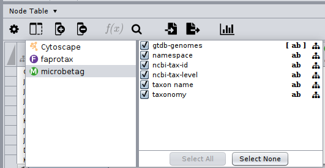
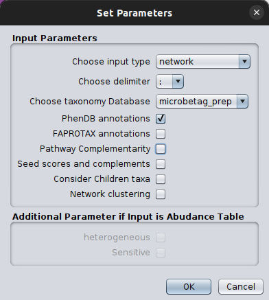
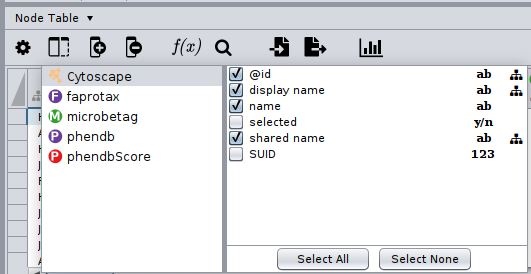
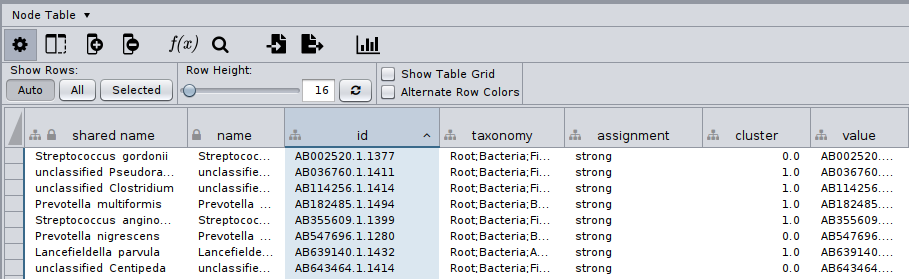
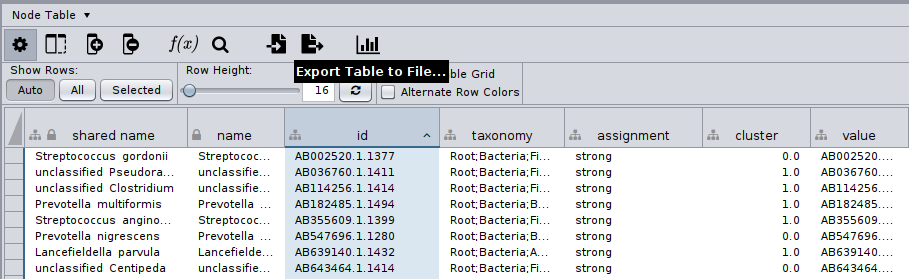
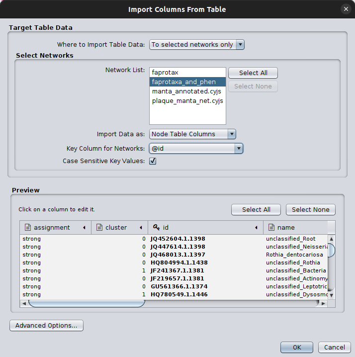

Large dataset
===================

```{Note}
We define a dataset as large if it is intended for use with `microbetagDB` and contains several thousand taxa (sequence IDs). While the number of samples also influences microbetag's runtime, its impact is significantly smaller.

If you want to annotate a dataset of any size using your own genomes, bins, or MAGs, follow the corresponding tutorial [here](local.md).

```

In case of large datasets, `microbetag` full on-the-fly run is probably not an option, even if you do run the preprocessing step. 

For example, imagine you have a 16S rRNA marker-gene dataset and a couple of hundreds of samples. 

Based on the [`microbetag_prep` tutorial](prep.md), you have taxonomically annotated them with the GTDB-oriented 16S reference database, and you built a co-occurrence network using FlashWeave. 

Now, let's say you wish to perform network clustering on your network. 
Asking for this on the on-the-fly version of `microbetag` will lead to a `RuntimeError` and your session will probably fail. 

```{important}
When working with large datasets, it is strongly suggested you run as many steps as possible locally. 

In its current version, the `microbetag` stand-alone tool does not support making API queries on `microbetagDB`
but this is on [top of our to-do list](https://github.com/hariszaf/microbetag/issues/20).
```

In this tutorial, we show how we handled such a large dataset.


## 16S rRNA data of hundreds of sub-gingival plaque samples from a Qiita project

<div style="display: flex; gap: 10px;">
   <a href="https://github.com/hariszaf/microbetag/tree/ms/examined_cases/enrichment" class="btn-purple"> Tutorial files </a>
</div>


From the record of the Human Microbiome Project (HMP) on [Qiita](https://qiita.ucsd.edu/study/description/1928), 
we first got the `.biom` of the study, and
using the [biom tols](https://biom-format.org/documentation/biom_conversion.html), we converted the `.biom` file to a `.txt`  

```bash
biom convert -i otu_table.biom -o hmp_otu_table.txt --to-tsv --header-key taxonomy
```

With the [`get_biom.R`](../_static/download/large_dataset/get_biom.R) script of ours, 
we were able to only collect subgingival plaque samples and get rid of zero abundance taxa,
building the [`Subgingival_plaque.txt`](../_static/download/large_dataset/Subgingival_plaque.txt) file. 

In Qiita, the first column corresponds to Silva sequence identifiers in which the OTUs of the study were mapped against. 
Since we cannot get directly the OTUs of the study, we used those identifiers, and with the `Silva_119_release.zip`
from the [Silva archive](https://www.arb-silva.de/download/archive/qiime), 
we got their Silva closest ones. 
This way, we ended up with an abundance table which in its last column had the Silva sequence instead of the taxonomy 
([Subgingival_plaque_Silva_seq.csv](../_static/download/large_dataset/Subgingival_plaque_Silva_seq.csv)).

```{note}
The code for this part is not included since this is beyond the scope of this tutorial.
The point of this step is that we started with a taxonomy table which had a rather old Silva version 
and we built an abundance table with the corresponding sequences instead of the taxonomies, in order to use the `microbetag_prep` tool.

In case you have your own OTUs/ASVs, you just need to use the abundance table with those along with the `microbetag_prep` tool. 
```


Using the `Subgingival_plaque_taxonomy_Silva_seq.csv`, we used the Docker `microbetag_prep` tool to get a GTDB-based taxonomy assignment and a FlashWeave network. 
To this end, we first created a folder called `subgingival_plaque` where we moved the 
`Subgingival_plaque_taxonomy_Silva_seq.csv` file. 
We then downloaded the [`config.yml`](../_static/download/large_dataset/config.yml) file for the `microbetag_prep` tool, 
and we set its parameters accordingly.
In this case, we set the `sensitive` parameter as `false`, since the number of taxa present would lead to a vast number of associations.
The `heterogeneous` parameter was also set to `false`. 

We then ran:
```bash
    docker run --rm -it --entrypoint /bin/bash -v ./subgingival_plaque:/media hariszaf/microbetag_prep:v1.0.1
```

This entered us on a container where our input data would be under `/media`.

```bash
    root@50a101bce75f:/pre_microbetag# ls /media/
    Subgingival_plaque_Silva_seq.csv  config.yml
```

we then ran the `microbetag_prep`

```bash
    root@9741096f8593:/pre_microbetag# python3 prep.py /media/config.yml 
```

which resulted in the `prep_output` folder, in the mounted `/media` folder:

```bash
    root@9741096f8593:/pre_microbetag# ls /media/prep_output
    GTDB_tax_assigned_abundance_table.tsv  network_output.edgelist
```

```{attention}
**CONFIGURATION FILE VERSIONING**

Make sure that you always use the configuration file version that matches the tool version you are using.
```

Thus, `microbetag_prep` returned [GTDB_tax_assigned_abundance_table.tsv](../_static/download/large_dataset/prep_output/GTDB_tax_assigned_abundance_table.tsv) that keeps the same sequence identifiers as the original but now the taxonomy has been replaced and instead of 
the Silva one, we have the GTDB. 
Also, the [network_output.edgelist](../_static/download/large_dataset/prep_output/network_output.edgelist)
is the result of FlashWeave

Up to this point, we actually run the [`microbetag_prep` tutorial](prep.md). 
So now, as in the preparation tutorial, we can use those two files with the on-the-fly version. 

Only this time, we can combine them with the stand-alone tool and/or the *microbetag* API. 

So, what we did was to first run the on-the-fly version asking just for the FAPROTAX and/or phenDB-like annotations, i.e. 
the node-level annotations. 

```{hint}
Since we already have a network and our taxonomies in `microbetag`'s prefered scheme, 
node-level annotations scale well on the on-the-fly version of `microbetag`! 🚀

However, you may also go for a step-by-step approach, retrieving first a FAPROTAX-annotated network 
and then, itse phenDB-like traits.
```

### Load base network - edgelist

From `File > Import > Network from file` we loaded the `network_output.edgelist` as it was returned by the `microbetag_prep` tool. 

We then loaded our updated taxonomy table on `MGG` by clicking 
`Apps > MGG > Import Data > Import Abundance Data`. 
We also loaded the already displayed on the main panel network of ours, on `MGG`, by clicking 
`Apps > MGG > Import Data > Import Current Network`.
We then performed a first round of `microbetag` annotation asking only for the FAPROTAX step


After a few seconds we got back a FAPROTAX annotated network; by clicking on the `Show Columns...` button of the Nodes table, we may see 
what are the namespaces of the columns of our networ:



We then used the FAPROTAX annotated network as input for a second round of `microbetag` annotation, 
this time requiring only the `phenDB` step. 




and after a couple of seconds we got back a network with both the phenDB-like annotations and the previous from FAPROTAX!



Now, we wanted to cluster our network using the `manta` algorithm that `microbetag` also makes use of.
We could do this either by installing `manta` and run it independently, or you can use it through the stand-alone tool. 
Using the `microbetag` wrapping functions we wrote the [`manta_large_dataset.py`](../_static/download/large_dataset/manta.py) to run `manta`.
As you can see, this script makes use of the initial `network.edgelist` and is independent of the annotation steps we performed above.  


After a couple of minutes (~15', depends on your computing system), 
we got the [`manta_annotated.cyjs`](../_static/download/large_dataset/manta_output/manta_annotated.cyjs),
a network in CYJS format carrying only the initial nodes and eges, and two new columns, one called `cluster` with the number 
of the assigned cluster to each node, and another called `assignement` with a characterization of the assignment either as `strong` or `week`.

```{note}
The `manta_basenet.cyjs` that was also returned, it is required from `manta` to run and it is just  
the initially provided network but in a CYJS format.
```

Now, we can load on Cytoscape the `manta_annotated.cyjs` clustered network, the same way we did before for the initial network.  
The node table of this would look like:




Finally, we can **bring our clusters together with our node annotations** by **importing a table**! 
To do this, we had to first export the `manta` annotated node table 



You can find the exported table called `manta_annotated.node.csv` [here](../_static/download/large_dataset/manta_annotated.node.csv)

```{hint}
On the exported `.csv` with the cluster column, make sure you convert the column to **integer**.
`microbetag` expects the `microbetag::cluster` to be integer, and clustering algorithms may return clusters as float!
```

And now, we can load the table with the clusters, by first moving to the network with the FAPROTAX and the phenDB-like annotations
and clicking on the `Import Table From File...` button. 
After selecting the `manta_annotated.node.csv`, we had to specify:
- in which of the open network collections to add the table; in our case we had named this `faprotax_and_phen`
- which column to use as a key to map on our network (`@id`):




Now, we have all required elements of the nodes annotation! 
We have both FAPROTAX and phenDB annotations and we also have clusters! 
Therefore, **after renaming the `cluster` column to `microbetag::cluster`**, we are good to go with the [**enrichment analysis test**](../basic_usage/enrichment.md)!

