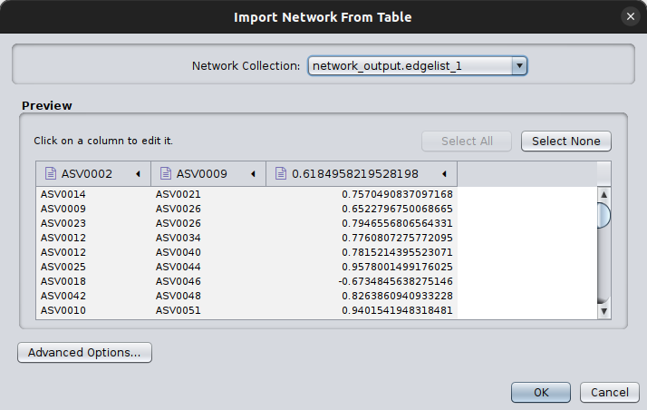
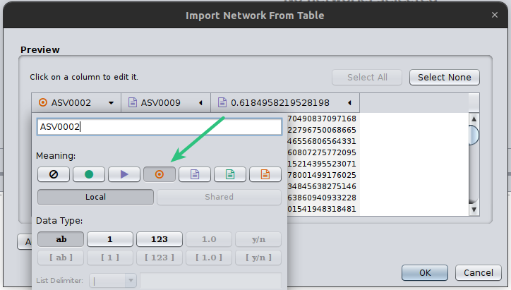
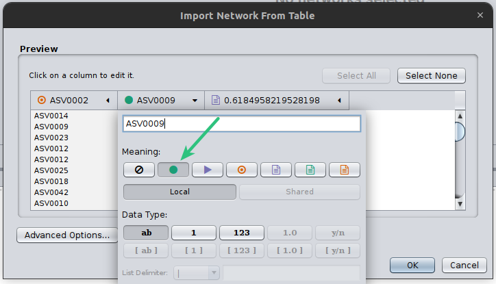
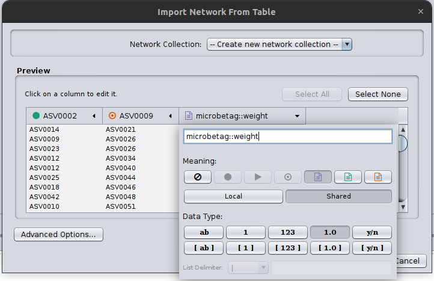
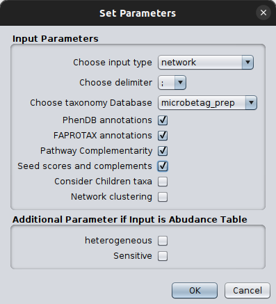
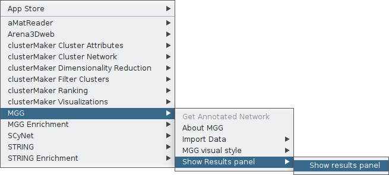

# Load networks to Cytoscape and `microbetag`


```{note}
**INPUT FILES USED IN THIS TUTORIAL**

For this tutorial we will use the output network of the [`microbetag_prep` step](./prep.md) called [`network_output.edgelist`][1]
and a previously annotated network with `microbetag` called [`microbetag_annotated.cx`][2]
```


## Load an edge list to be used with `microbetag`

In this case, you need to first load your network on Cytoscape and then import it on the MGG. 
We show how to do that in the [Cytoscape App Tutorial](../basic_usage/from_net.md). 

```{note}
Remember, you need always to call the column to be used as weight of the network as `microbetag::weight`.
```


## Load edge list coming from the `microbetag` preparation step

The preparation step should have provided you with: 
- the `GTDB_tax_assigned_abundance_table.tsv` and/or 
- the `network_output.edgelist` files. 

Now, we can get those two files returned and jump into Cytoscape. 
Open Cytoscape and then click on `File > Import > Network from file` and browse on the pop-up box to your `network_output.edgelist` file. 

You will then see another pop up box like this: 

 

Cytoscape needs always to have a *source* and a *target* node, even in cases of undirected graphs, such as the co-occurrence networks.
Therefore, click on the first two column headers and set one as the source and the other as the target by clicking on the corresponding symbols: 






Finally, you need to always set the column that `microbetag` will consider as your weight column, in this case, we have only one column with a weight however in cases that a network is not built like that, may have several. 
Thus, you need to click on the corresponding column header and set it as `microbetag::weight`.
Now `microbetag` is able to recognize which column to handle as the *weight* of your network.
By clicking `OK` your network will be shown on Cytoscape's main panel. 



Now you are ready to import your abundance table. 
Go to `Apps > MGG > Import Data > Import Abundance Data` and browse to the `GTDB_tax_assigned_abundance_table.tsv` file returned from the `microbetag_prep` running.
Load the network data to the app by clicking `Apps > MGG > Import Data > Import Current Network`.

```{note}
The order here is important! `microbetag` will not allow you to import first your network and then your abundance table. 
```

You can check on the imported date by clicking `Apps > MGG > Import Data > Check Data Files`.
Once you make sure you have loaded what you wanted, you are ready to ask `microbetag` to annotate your network! 
Just click `Apps > MGG > Get Annotated Network`.
Set the parameters as discussed in the [*Run `microbetag` from a co-occurrence network*](../basic_usage/from_net.md) section.




Then, click `OK`. 
Then a *Sending data to the server* loading bar will appear. 
After a few moments, a new network will pop up on your Cytoscape main panel! 

That's it! 
You may now [*"roam"* across your annotated network](../basic_usage/roaming.md#roaming-acrross-annotated-nodes-and-edges).


## Load already `microbetag`-annotated networks!

If you have already a `microbetag`-annotated network, that will be a `.cx` file which you can load as any other network on Cytoscape, i.e., by clicking 
on `File > Import > Network from file`. 

Make sure you enable the MGG style and cyPanels:





[1]:../_static/download/load/network_output.edgelist
[2]:../_static/download/load/microbetag_annotated.cx


