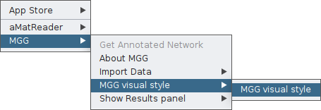
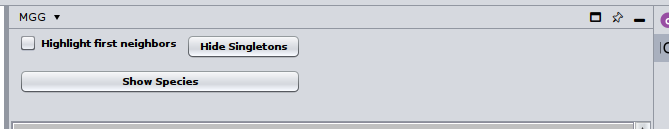
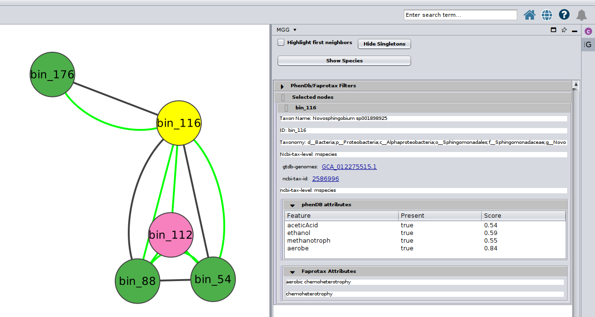
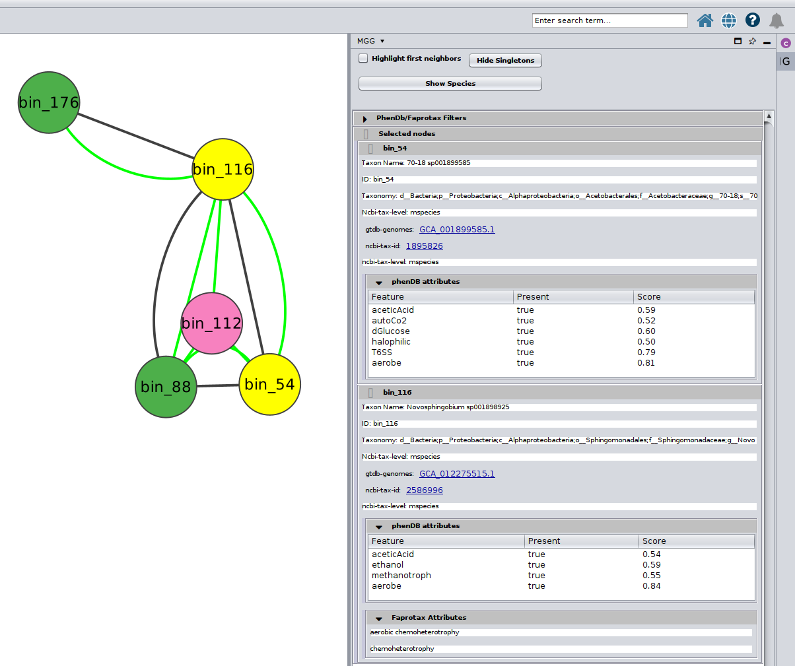
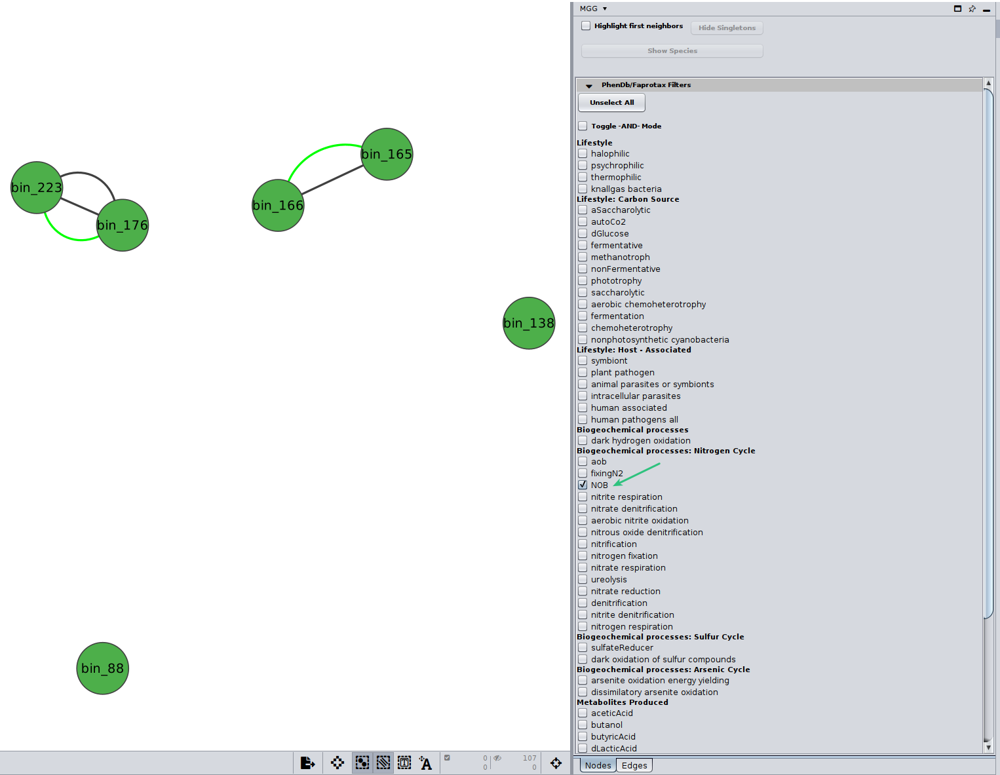
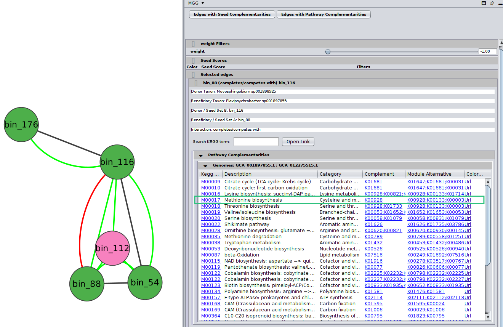
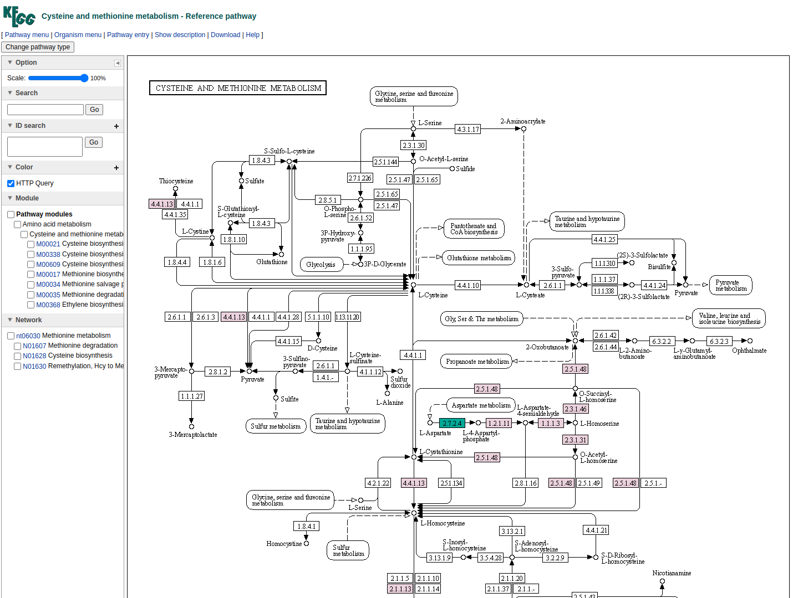
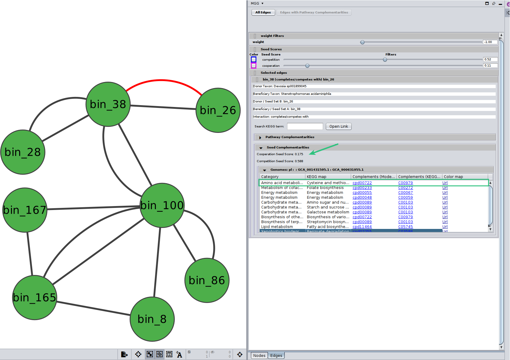
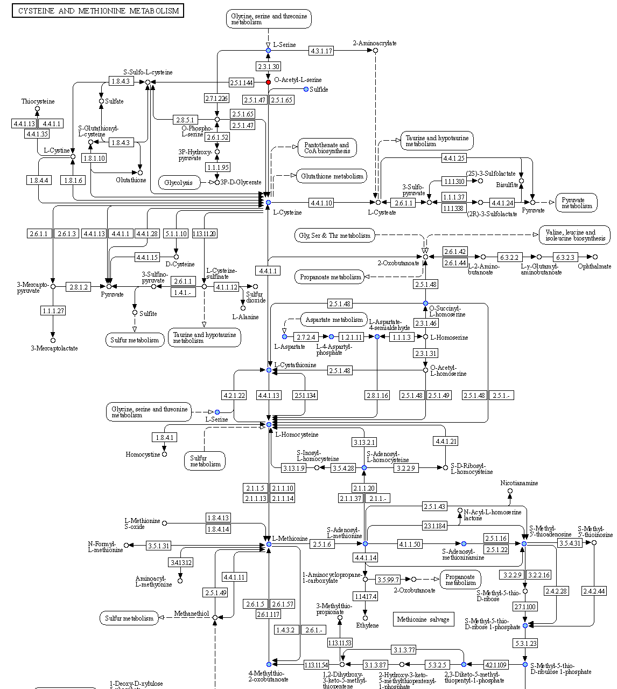

# Exploring annotated networks


## Exploring annotated nodes and edges


```{important}
**INPUT FILES USED IN THIS TUTORIAL**

We will use the `microbetag`-annogated network of the [network-based example-case](from_net); you can get directly its corresponding `microbetag` - annotated network from [here][1].
```
Once an annotated network is returned (or 
<!-- [loaded](../basic_usage/load) -->
loaded
) on your Cytoscape main panel, you have all Cytoscape features (e.g., annotation, filtering, selecting etc.) plus those coming from the microbetag App facilitating a user-friendly way to go through the annotations returned.


Color-coding of the nodes (taxa) denoted the taxonomic level that a certain sequence was able to be mapped on *microbetag*.

- <p style="color : Green">green</p> node was mapped to a genome (i.e. species/strain) and annotations are available for it 
- <p style="color : Magenta">pink</p> node was mapped to the genus level; annotations limited to literature-oriented (FAPROTAX) 
- <p style="color : Purple">purple</p> node was mapped to the family level; likewise, only FAPROTAX annotations occasionaly
- <p style="color : Red">red</p> node was mapped to higher taxonomic level and no annotations were returned


If you edit the style of your *microbetag*-annotated network, you can always bring back its original style through the MGG main menu.




Now, if already opened, you need to open the MGG results panel; just click 
`Apps > MGG > Show Results panel > Show results panel`
<!-- (see also [Loading models](../basic_usage/load#load-already-microbetag-annotated-networks) tutorial). -->

Once your *microbetag*-annotated model is imported and the MGG results panel opened, you can now browse the network along with its annotations using both Cytoscape core features and those of MGG. 

Notice that the MGG results panel on its bottom has two options: 
the **Nodes** and the **Edges** panels. 
By default, the **Nodes** panel is selected. 
Let's start with that then!

{: .note}
Remember that you can always use the Cytoscape core features on a `microbetag`-annotated network.
That means for example, in case you would prefer a different style than the one provided, you can always change node and edges colors and shapes etc. You can do this always for groups of nodes/edges. Anything you could do with a network on Cytoscape is still an option for a `microbetag`-annotated network.


## Investigating nodes' annotations

By clicking on the *Show Species* button, all nodes that were not mapped to a genome will be masked. 




Or you can choose/click directly any node on the network and check the `Nodes` Panel 




or several at the same time




For more about how the PhenDB-like traits are assigned in each node you may have a look [here](../modules/modules.md#based-on-phendb) and for a thorough list of all the traits supported, 

you may check the corresponding [table](../modules/phen-traits).

In addition, for the FAPROTAX-based annotations, you may have a look [here](../modules/modules.md#based-on-faprotax) for how it works, and you can go through the whole list of potential traits supported in this [table](../modules/faprotax-functions).


### Filter for traits

You may select among a list of annotations under the `PhenDb/FAPROTAX filters` with `AND` and `OR` relationships.
For example, I was curious about the Nitrite-oxidizing bacteria (NOB) on my network




Likewise, you may go through the annotations on the edges of the network.

<!-- <p style="color: rgb(135,206,235)">Welcome to freeCodeCamp!</p> -->
Edges are either
 - <p style="color : Green">green</p> mentioning co-occurrences
 - <p style="color : Red">red</p> suggesting mutual exclusion of the two taxa
 - <p style="color : Black">black</p> representing ***directed*** potential metabolic interactions. 


## Investigating edges' annotations

Now, you can click on the **Edges** button on the bottom of the MGG panel to *jump* to the Edges annotations.

### Potential pathway complementarities

By clicking on a potential metabolic interaction edge, the donor and the beneficiary species, along with their corresponding sequence identifiers will be displayed.

Then, for cases where pathway complementarities have been returned for this association, a panel will be available for each pair of genomes that were mapped to those two taxa. 
For each pair of genomes, a list with the potential metabolic complementarities is then returned. 
In the first column the KEGG MODULE id of the corresponding complementarity is provided, and in the second and third column their description and metabolism category. 
In the fourth column, called *"Complement"* the KO that need to be provided to the beneficiary species to support the module are given and in the next column, the complete alternative that would then facilitate the module is shown; i.e., assuming the complement is provided.



In the final column a link to a related KEGG map is provided where KO available in the beneficiary species are colored with pink and those provided by the donor in the scenario of the potential metabolic interaction with green.
The screenshot below illustrates the highlighted complementarity in the biosynthesis of methionine.




### Potential seed complementarities

Like in the case of the pathway complementarities, a new panel is displayed when seed complements are available for an edge.
Here is an example:




[*Seed scores*](../modules/modules_background.md#seed-scores-and-complements-based-on-genome-scale-draft-reconstructions-gems) between the two genomes are also shown here. 
Remember that like the edge under study, seed scores have also *directionality*; seed score for competition between $genome_A$ and $genome_B$ is not necessarily the same with the one between $genome_B$ and $genome_A$.
Those scores are only indicative, and they should not be considered as fact of observed cooperation/competition. 
Seed complements are then recorded in the same way as pathway complementarities.
However, there is no *Complement* column as this time it is not a specific KEGG MODULE that is supported, rather a potential range of functions that can be viewer through the colored url. 
Also, a new column provides the ModelSEED compound id that was actually found as a complement and was then mapped to their KEGG corresponding one. 




## Save your work 


The best approach is to save your entire session, as you will likely apply various filters, annotations, and other modifications to your `microbetag`-annotated network. Simply click on `File > Save Session As...`, assign a name to your session, and Cytoscape will generate a `.cys` file. This allows you to reload the session later and resume exactly where you left off.

You can also export your network by using the rest of Cytoscape options.


[1]:../_static/download/mgg/hessler_microbetag_network.cx
