# `microbetag` on Cytoscape
{: .no_toc }

---

{: width=25% }

## Run `microbetag` Cytoscape app

All you need to do for start using *microetag* is first, to [download Cytoscape](https://cytoscape.org/download.html) in case not already on your computer, and then
install the *microbetag* app (`MGG`) from [Cytoscape App store](https://apps.cytoscape.org).
The latter can also be performed from within Cytoscape by clicking on the `Apps` tab of the main bar and then `App  Store > Show App Store` and typing `microbetag` on the box that pops up.

Once the app is installed, you may click on the `Apps` tab and you will find *MGG* there.

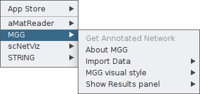

From this box, you will have access to all features of the app. 
As you see, the *Get Annotated Network* is currently not a clickable option. 
That is because *microbetag* has no input yet. 

You need first to feed the app with your abundance table and, if available, your co-occurrence network.
In both cases though, the abundance table will be required and this is why when you click on *Import Data* you 
currently see only the *Import Abundance Data* option.

<!-- 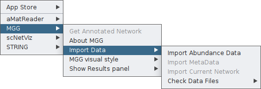  -->

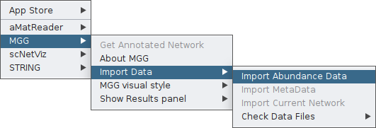

By clicking on it, a pop-up box will ask you to provide your abundance table. In this example, we will use the `vitAbund.tsv` file. 
Select it whith you mouse and then open it. 

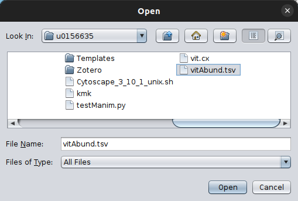

To make sure of the imported data, you can then *check* them, using the corresponding option from the *Check Data Files* feature, in this case the abundance tabe:

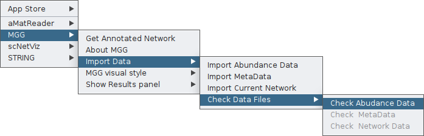

Once clicking that, a table will pop up where you can go through the data you have imported as the abundance table. 

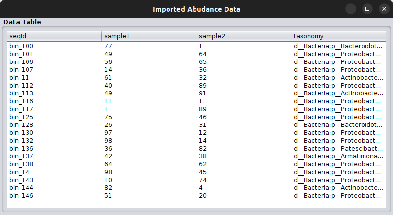

Please, make sure your taxonomy fits the criteria for *microbetag* to run. 
You may find more on that issue on the [*Input files*](./input.md#input-files) section.

## .. starting from an abundance table

In this case, *microbetag* can come up with a co-occurrence network using FlashWeave. 
The on-the fly creation of the co-occurrence network is supported only for abundance tables with **up to 1000 records**. 

Once your abundance table is imported, you can now ask for a *microbetag-*annotated network by clicking on the corresponding feature:

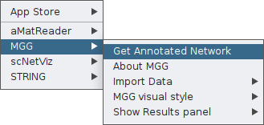

Once clicking on that, a parameter-setting box will pop-up, asking for values on a number of parameters **essential** for the successful network inference and their corresponding annotation.

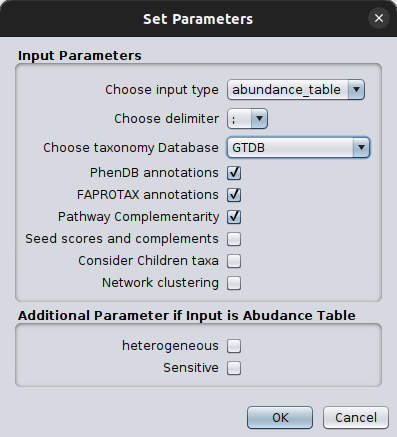

Please make sure you set the input type as `abundance_table` and you select the correct [taxonomy scheme](./input.md#input-files).
It is crucial to also set the [FlashWeave related parameters](./faq.md#what-is-sensitive-and-heterogeneous-in-flashweave) in a way they address your abundance table idiosyncracy.

{: .important}
We suggest you do the network inference step as well as the mapping to the GTDB taxonomy before using *microbetag* through the Cytoscape App as this would provide you extra freedom on they network inference and gain dramatically in computing time on the server.

Once you set the parameters of your choice, you are ready to sent your query to the server by clicking *ok*. 

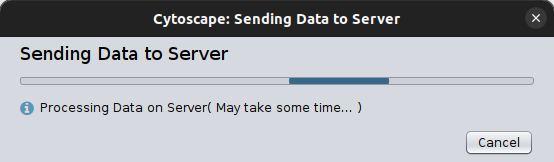

After a few minutes (based on your data and the steps you have asked for) a *microbetag-*annotated network will pop up automatically on your Cytoscape instance.

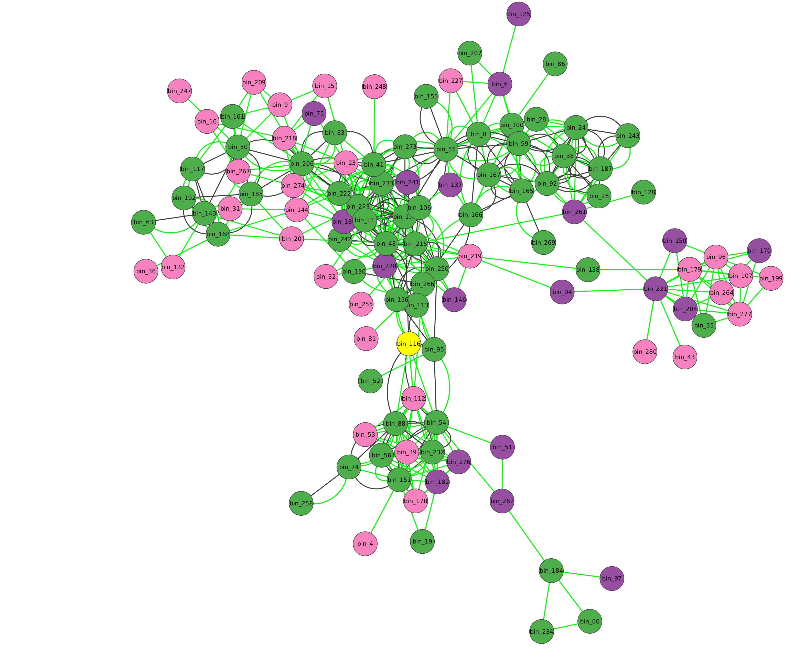

{: .important-title}
> UP LIMIT FOR ABUNDANCE TABLE RECORDS
> 
> *microbetag* will build a co-occurrence network only for abundance tables with less than 1000 of records. 
> In case your abundance table is larger, you will have to run the [microbetag prepropcess steps](./input.md#the-preparation). 
> Otherwise, you can always run any algorithm for network inference locally and use their findings with microrbetag.

## .. starting from a co-occurrence network

If you already have a network, then you need to provide both the network and the abundance table and **make sure that the sequence identifiers in those two files are the same**; meaning that the node ids of the network are present in the abundance table in the column representing the sequence identifier. 

For example, a toy model of a network file would be: 

| node_A | node_B | weight  | 
|:-------:|:-----:|:-------:|
| bin_1 | bin_2 | 0.84 |

then, the corresponding abundance table would have, among other records, to have the following two lines:

| sequenceIdentifier | sample_1 | sample_2| sample_3| taxonomy | 
|:------------------:|:--------:|:-------:|:-------:|:-------:|
| bin_1|  234 | 42 | 43| g__Devosia;s__Devosia sp001899045
|bin_2 | 324| 54 | 43 | 

Once you are sure of these requirements, you can import your network through the main `File` tab of Cytoscape:

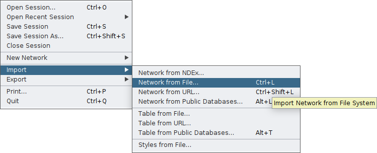

and then import it to MGG though its main menu on the `Apps` tab:

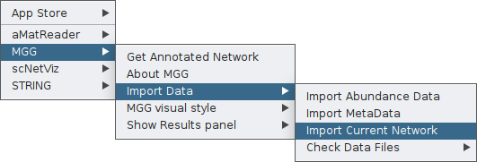

Finally, you can again check your network as loaded on MGG through the `Check Data Files` tab:

{: .important }
If the node names of the network are not included in the sequence identifiers of the abundance table, you will not be able to import your network to MGG.

Once both your abundance file and your network are imported, you can proceed as in the [*Starting from an abundance table*](cytoApp.md#starting-from-an-abundance-table) case by clicking on `Get Annotated Network`  on the main menu of the `MGG` app on the `Apps` tab and setting the parameters required.

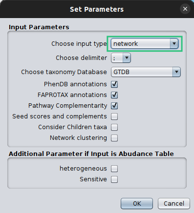

Make sure that you set the `Choose Input Type` as `network` this time, otherwise `microbetag` will ignore your network and try to build on of their own. 

## *"Roaming"* acrross annotated nodes and edges

Once an annotated network is returned (or loaded), you have all Cytoscape features (e.g., annotation, filtering, selecting etc.) plus those coming from the microbetag App facilitating a user-friendly way to go through the annotations returend. 

Color-coding of the nodes (taxa) denoted the taxonomic level that a certain sequence was able to be mapped on *microbetag*.

- 
green
 node was mapped to a genome (i.e. species/strain) and annotations are available for it 
- 
pink
 node was mapped to the genus level; annotations limited to literature-oriented (FAPROTAX) 
- 
purple
 node was mapped to the family level; likewise, only FAPROTAX annotations occasionaly
- 
red
 node was mapped to higher taxonomic level and no annotations were returned

If you edit the style of your *microbetag-*annotated network, you can always bring back its original style through the MGG main menu.

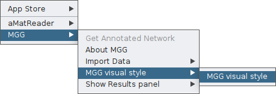

By clicking on the *Show Species* button, all nodes that were not mapped to a genome will be masked. 

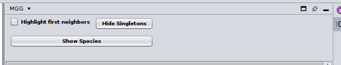

Or you can choose/click directly any node on the network and check the `Nodes` Panel 

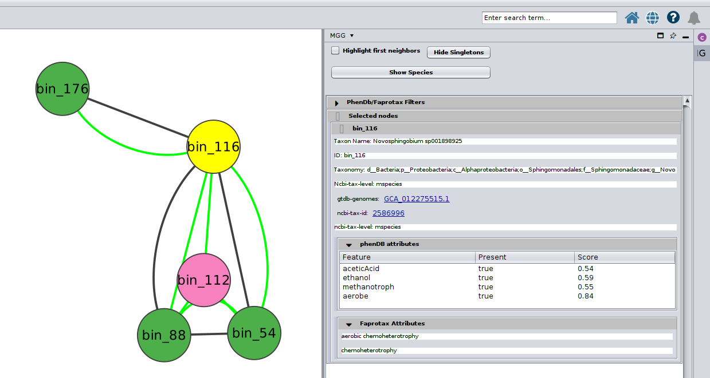

or several at the same time

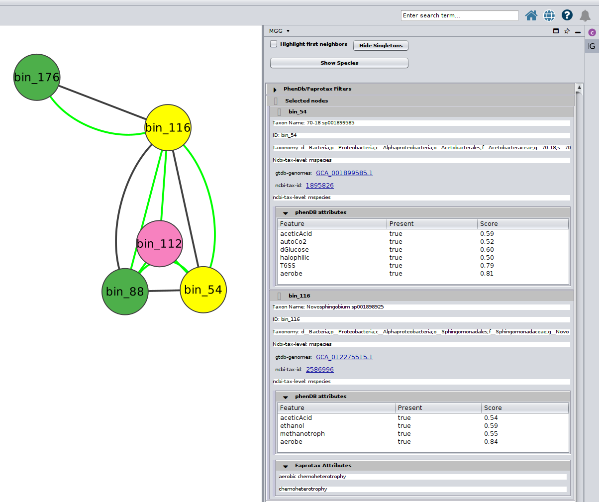

Further, you may selecet among a list of annotations under the `PhenDb/FAPROTAX filters` with `AND` and `OR` relationships.
For example, I was curios about the Nitrite-oxidizing bacteria (NOB) on my network

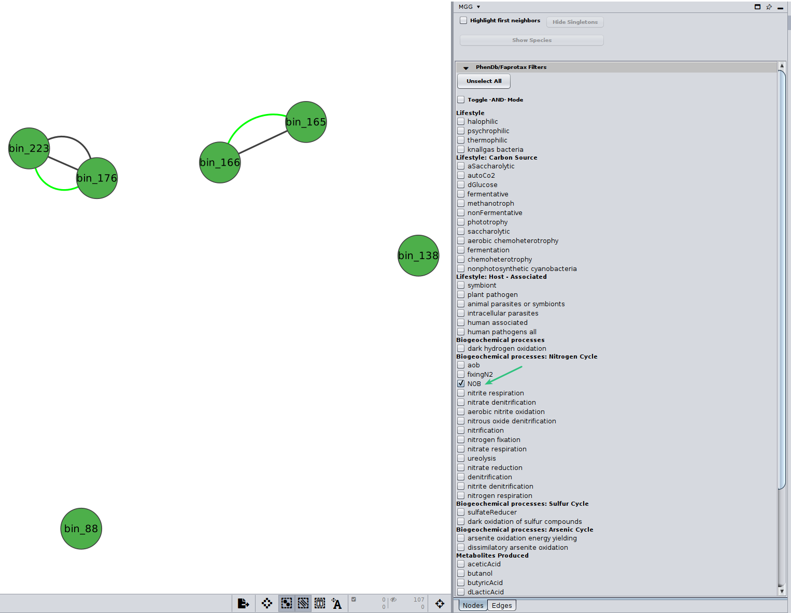

Likewise, you may go through the annotations on the edges of the network.

<!-- 
Welcome to freeCodeCamp!
 -->
Edges are either
 - 
green
 mentioning co-occurrences
 - 
red
 suggesting mutual exclusion of the two taxa
 - 
black
 representing ***directed*** potential metabolic interactions. 

One may select from the two top buttons on the `Edges` panel to show only edges with pathwawy complementarities or seed complementarities.

By clinking on a potential metabolic interaction edge, 
the donor and the beneficiary species, along with their corresponding sequence identifiers will be displayed
highlighting who potentially benefits from the other.

Then, for cases where pathway complementarities have been returned for this association, a panel will be available for each pair of genomes that were mapped to those two taxa. 
For each pair of genomes, a list with the potential metabolic complementarities is then returned. 
In the first column the KEGG MODULE id of the corresponding complementarity is provided, and in the second and third column their description and metabolism category. 
In the fourth column, called *"Complement"* the KO that need to be provided to the beneficiary species to support the module are given and in the next column, the complete alternative that would then faciliate the module is shown; i.e., assuming the complement is provided.

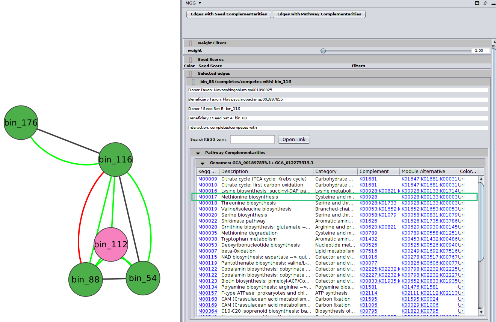

Last but not least, in the final column a link to a related KEGG map is provided where KO available in the beneficiary species are colored with pink and those provided by the donor in the scenario of the potential metabolic interaction with green.
In the following screenshot the map of the highlighted complementarity regarding the biosynthesis of Methionine is shown.

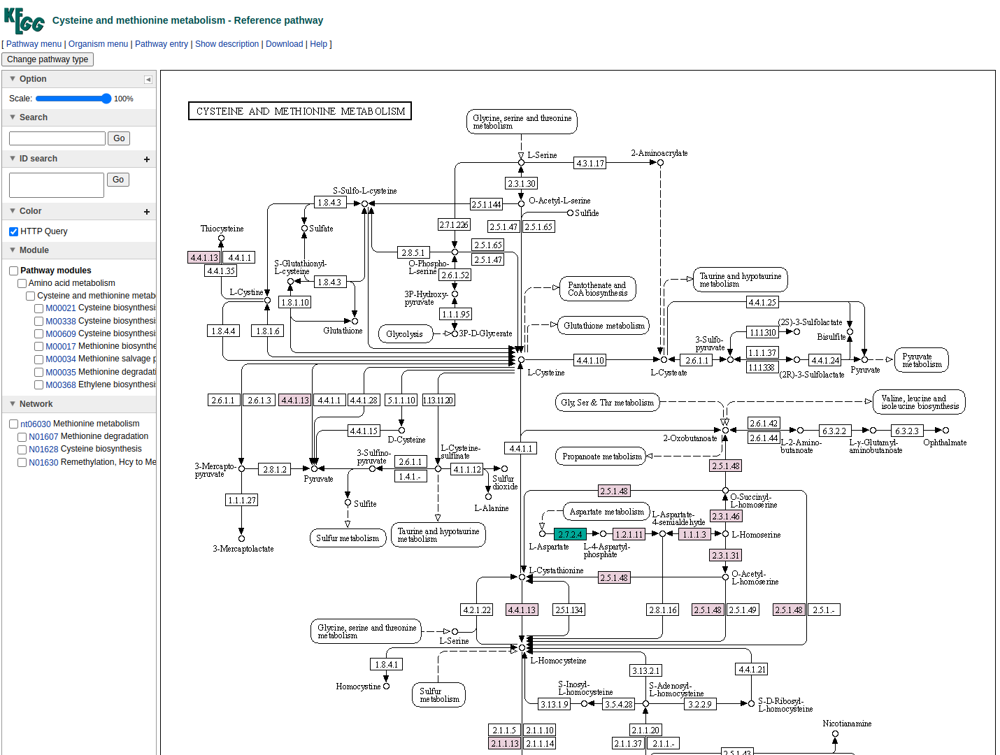

Likewise, for the seed complementarities, a new panel is displayed when such are present in an edge.
Here is an example:

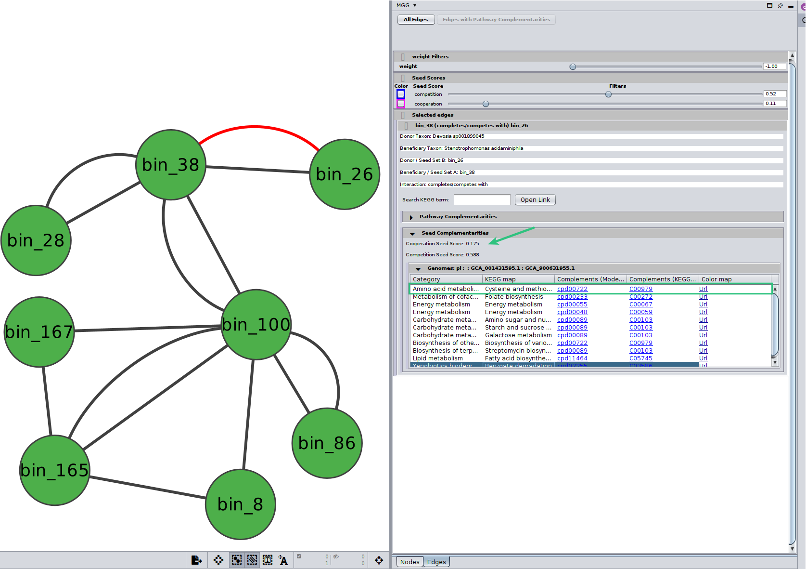

Please, look out for the [*seed scores*](./modules/modules.md#seed-scores-based-on-genome-scale-draft-reconstructions-gems) that are usually also shown there. 
Those scores are only indicative and they should not be considered as fact of observed cooperation/competition. 

This time it is KEGG COMPOUNDS that are highlighted in the maps and it is not certain that a specific KEGG MODULE is added in those the beneficiary species can go for. 

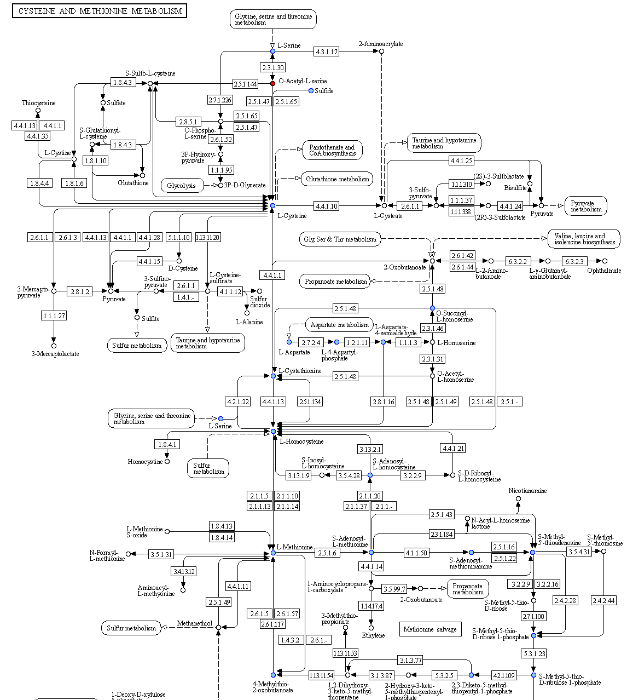

<!-- 
To check 

Sensitive vs fast mode
• Implementation of
conditional independence:
– Sensitive mode: partial
correlations on abundances,
assumes multivariate normal
distribution (weak assumption)
– Fast mode: mutual information
on presence/absences

HE mode
• FlashWeave can optionally ignore
zeros (‘structural zeros’) to deal
with heterogeneous samples 

multi-habitat or -protocol data sets with ideally at least thousands of samples;

sensitive=false for faster, but more coarse-grained associations

## example
Here we need a step-by-step with screenshots and/or videos of the features of 
 -->
