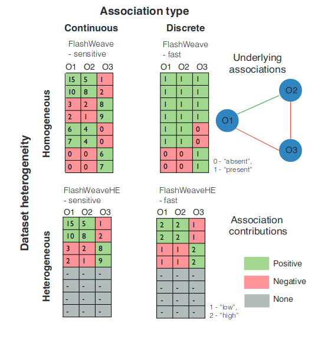

## What is sensitive and heterogeneous in FlashWeave? 

heterogeneity of these cross-study data sets, such as variation in habitats, measurement conditions, and sequencing technology, can lead to confounding associations, typically not addressed by current methods

Sensitive modes (-S) of FlashWeave use full abundance information (”continuous”), while fast modes (-F) work on discretized abundances. In contrast to FlashWeave, FlashWeaveHE excludes samples in which one partner is absent (colored grey). However, it still includes absences of OTUs within the conditioning sets.

Meta variables (MVs) are by default not normalized for FlashWeave-S and FlashWeaveHE-S and should thus, if necessary, be provided in a sensible pre-normalized format by the user. For FlashWeave-F and FlashWeaveHE-F, continuous MVs are by default discretized into two bins separated by their median.

## How to choose a taxonomy scheme ? 

For microbetag to return the best annotations it could come up with, it is essential to map as best as possible the sequences described in your abundance table to
corresponding GTDB genomes. 
There are 4 taxonomy schemes supported:
- `GTDB`: in case you have used GTDB-tk to taxonomically annotate your bins
- `Silva`: in case you have used DADA2 along with the 7-level version of Silva they support
- `microbetag_prep`: in case you have amplicon data and would like to use our implementation for mapping your OTUs/ASVs to GTDB genomes directly by using the `idataxa` algorithm of the DECIPHER package and the 16S genes of the GTDB genomes as a reference database. For large datasets (>1000 sequences) see also 
- `other`: in case you want to use your taxonomies and get the closest NCBI Taxonomy names inclueded in the microbetagDB (using the `fuzzywuzzy` Python library)

## Why using the `get_children` feature? 

## Positive associations with high competitions seed score ? 

## How to read a KEGG map with pathway complementarities ? 

