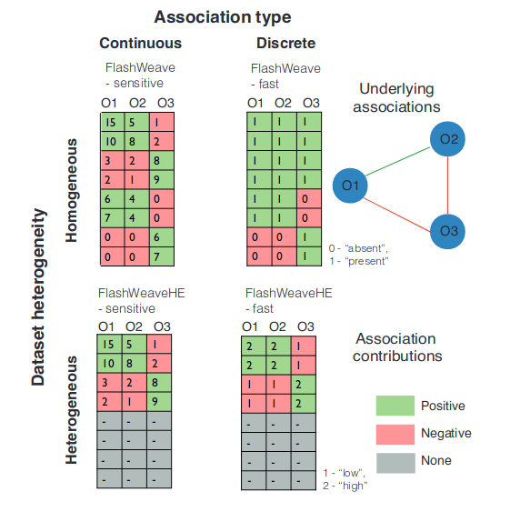
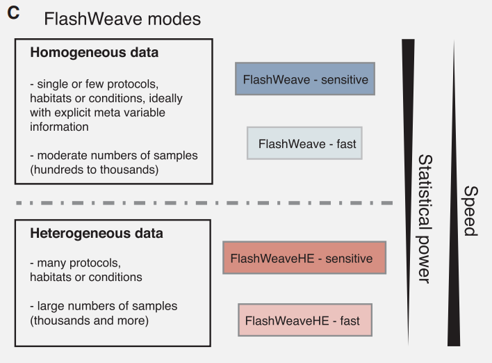

# Frequently Asked Questions

## Setting the parameters right


### Choose input type

   It should be clear by now that you always need to load your abundance table. 
   If you wish `microbetag` to infer a co-occurrence network using FlashWeave then go ahead 
   and set this parameter to `abundance_table`.
   In case you already have a network, and you have loaded it to MGG as described in the 
   [relative tutorial](./tutorials_core/load.md) then you may set this parameter to `network`, 
   so `microbetag` will annotate the provided network. 


### What taxonomy scheme to choose ? 

   For microbetag to return the best annotations it could come up with, it is essential to map as best as possible the sequences described in your abundance table to
   corresponding GTDB genomes. 

   There are 4 taxonomy schemes supported:

   - `GTDB`: in case you have used GTDB-tk to taxonomically annotate your bins

   - `Silva`: in case you have used DADA2 along with the 7-level version of Silva they support

   - `microbetag_prep`: in case you have amplicon data and would like to use our implementation for mapping 
   - your OTUs/ASVs to GTDB genomes directly, by using the `idataxa` algorithm of the DECIPHER package and the 16S genes of the GTDB genomes as a reference database. 
   For large datasets (>1000 sequences) see also 

   - `other`: in case you want to use your taxonomies and get the closest NCBI Taxonomy names included in the 
   _microbetagDB_ (using the `fuzzywuzzy` Python library)


### When to enable the `sensitive` and `heterogeneous` arguments? 

   Both these parameters are arguments of the FlashWeave software.
   Therefore, they are only available if you have selected `abundance_table` as your input type.

   <!-- Before jumping to the details for each of those 2 main arguments, let's see briefly how FlashWeave works. -->
   The core idea for FlashWeave is to distinguish direct and indirect associations between the taxa of an abundance table.
   More specifically, for each target variable $T$ (OTU/ASV or a _metavariable_), 
   FlashWeave tries to infer its **directly associated neighborhood**, 
   meaning the *set* of neighbor variables that renders all remaining variables **probabilistically independent** of $T$. 

   To this end, statistical tests for conditional independence iteratively remove indirect edges.
   In each iteration a **pair of taxa** is tested to be directly associated or not and a **conditioning set** of other taxa is used to test whether the association between the two taxa under study disappears or significantly weakens when conditioning on another taxon.

   Apparently, the abundance table is all FlashWeave cares about!
   The figure below comes from the Supplemental Information of the 
   <a href="https://www.sciencedirect.com/science/article/pii/S2405471219302716#appsec3" target="_blank">FlashWeave paper</a>.


   


   ***Sensitive*** modes of FlashWeave use _full abundance_ information (*continuous*), while ***fast*** modes 
   (i.e., when the `sensitive` parameter is **not** selected) 
   work on discretized abundances.

   As a rule-of-thumb, the `sensitive` module requires further computing resources and time, 
   thus it may lead the online version of `microbetag` to time errors. 
   In this case the user can always go for the [`microbetag_prep`](./tutorials_otf/prep.md) steps 
   to infer the network locally. 
   However, in other cases, especially when the number of samples is low, 
   **not** choosing the `sensitive` mode can also lead to errors.
   This is because FlashWeave fails to infer any relationship at all, so there is no network for `microbetag` to annotate! 
   :information_desk_person:

   

   The `heterogeneous` module (`FlashWeaveHE`) makes the assumption that zeroes in large, heterogeneous data sets are mostly structural. 
   Thus, it only considers samples in which both OTUs/ASVs have a non-zero abundance as reliable for association prediction. 
   Zero elements are excluded from association computations. 
   However, this restriction only affects the potential association partners being tested: 
   OTUs in the conditioning set keep their absences.

   The `FlashWeaveHE` approach may lose in sensitivity but in large datasets this loss has been found to be rather small,
   while saving significant computing time.
   Yet, if applied in small datasets it can also lead to no network inference and therefore `microbetag` to fail.


### What is the *Consider children taxa* parameter?

   This parameter is only valid if the taxonomy database selected is `Other`. 
   In this case, `microbetag` tries to use the taxonomies provided to their closest NCBI Taxonomy. 
   There is a chance that your OTU/ASV has been assigned to a species for which a genome 
   is not present in _microbetagDB_, but genomes of strains of that species are. 
   By enabling this parameter `microbetag` will consider those genomes and use them for the following annotation steps. 


   ```{note}
   We remind that it is always a good practice in terms of getting as many and as good as possible annotations 
   to run the [`microbetag_prep`](./tutorials_otf/prep.md) step instead of using the `Other` taxonomy.
   ```


## I can't get an annotated network, despite having correct input files and well-tuned parameters

   This may be caused because of the time limit of our server for a single run. 
   Thus, there are cases for which even the number of sequence identifiers is less than 1000, 
   combinations of other factors can lead to time-consuming runs, causing an error in the end. 

   For example, you have set taxonomy to `other` and you have also chosen `sensitive` 
   as a parameter for the network inference. 
   Such a scenario often leads to time-errors. 
   In this case, you should first run the [`microbetag-prep`](./tutorials_otf/prep.md) step 
   and use its output as your input files. 

   Also, you may have a short number of taxa but a vast amount of samples. 
   In this case, you will also get a time error in case you enable the `sensitive` parameter of FlashWeave.

   It is always a good practice to run the preparation step locally, 
   so you also have a better overview of the network you will then ask `microbetag` to annotate. 
   Remember that `microbetag` focus is in annotating a network, not building one. 

## Frozen `Sending data to server` pop-up

   In cases where a time error has occurred, we have observed that from time to time, 
   the pop-up box with the progress of your query, keeps showing that your data are in process.
   If that happens, you need to **kill** the process of the Cytoscape instance.

   For example, in a Linux system, you would have to check on your `htop` panel which is the `PID` for Cytoscape, 
   and then run `kill <PID>`.


## GTDB and _microbetagDB_ versioning

   GTDB releases a new version once a year, most of the time in April increasing its number of genomes to a great extent from version to version. 
   Even the number of high quality genomes is not increasing that fast, the pairs for `microbetagDB` to store increases exponentially.
   We intend to develop a new feature to export new reference genomes and run precalculations over them once a year, following GTDB versioning. 
   <!-- Thus, `microbetag` to integrate the new genomes that are members of the genome clusters already there, meaning `microbetagDB` will try to follow the GTDB updates.
   Yet, new calculations will be performed only once a finer way to store the billions of complements is developed. -->
   Yet, this is still work-in-progress.


   <!-- ## Why using the `get_children` feature? 

## Positive associations with high competitions seed score ?  -->


## How to read a KEGG map with pathway complementarities ? 

   Complementarities need to always be considered as **potential**.
   There is no evidence that just because a complementarity could be occurring based on the genomes of a species pair, 
   that is actually happening. 
   To argue about such a case, one would have to get experimental data. 

   Regarding the pathway complementarities, one need to consider that such a complement,
   does not take into account what is happening to the others. 

   Thus, in cases where both $pathway_A$ and $pathway_B$ lead to the same end-products,
   and $species_A$ possesses a complete alternative for $pathway_A$ but lacks a complete $pathway_B$,
   while $species_B$ could potentially complement $pathway_B$,
   _microbetag_ would still report this potential complementarity.
   This is true even if $species_A$ does not require assistance, as it already obtains the end-products via $pathway_A$.

   The number of the KOs required for a complementarity to happen (number of KO in the `Complement` column) is also indicative for its likelihood. 
   If only one KO term needs to be provided by the donor species to the beneficiary, complementarity is more likely to occur compared to a situation where several KOs are required. 
   Also, in case there are also *seed complementarities* available for a species pair, you can combine information from both types of complementarities. 
   If a *seed* is close to the pathway mentioned from your pathway complementarities, this adds some extra confidence for the latter to occur. 


## I am trying to run `microbetag` locally, but.. 

   When running `microbetag` locally (see [relative tutorial](./tutorials_local/local.md)) 
   one may have a wide range of different input files as starting points.

   You could start with nothing but your bins; i.e., sequencing files, one for each bin mentioned in your abundance table. 
   Otherwise, you may have already annotated them with KEGG ORTHOLOGY terms. 
   Or you may already have reconstructed GEMs on your own. 


   ```{important}
   When using the local version of *microbetag*, remember you do not need to go for all the different annotation types!

   That means that if for example you are not interested in pathway complementarities, you may set this step as `false` on the configuration file
   and in that case, the time consuming step of KEGG ORTHOLOGY annotation would be skipped. 
   ```

   You can adapt your `microbetag` run by pointing to these files through the 
   <a href="https://github.com/msysbio/microbetag/tree/develop/config_files" target="_blank">`config.yml`</a>
   file you have to provide as input.
   However, we cannot say for sure that no matter the software you used to annotate 
   for example your bins will suit what `microbetag` expects.

   If you have a high number of bins, and you would prefer to avoid annotating them again using `microbetag` this time, 
   you may check the format of the annotations provided in the example case and see if you can edit your format to that. 
   In any case, we strongly suggest you reach out the 
   <a href="https://matrix.to/#/#microbetagcommunity:matrix.org" target="_blank">`microbetag`'s community on Matrix</a> 
   with any specific questions of yours.


## I have a really large 16S-oriented network. What can I do? 

   There are three things you could do in this case.
   First, you can try to build a database with the closest genomes you can find for the strains present in your data. 
   If you do so, then you could run `microbetag` locally using those genomes as they were your bins. 

   Second, you could build a local instance of `microbetagDB` locally. 
   This would require a storage of ~700GB.
   <!-- REMEMBER! Edit next phrase once coplete -->
   We are now working on an efficient way to go for that. 

   Third, you can get the annotations per species pairs using the `microbetag` API. 
   However, in this case, you will not have a `.cx2` file as an end product, 
   i.e. you will not have a single file you can then load on Cytoscape and view through the `MGG` features. 


## Can't import files on my macOS

   Make sure you are not using aliases pointing to the files you need to import.
   Sometimes you may use aliases even without knowing, 
   for example when you drag and drop a file on Finder, you create a shortcut of the file there, but the file is actually located in its original location.
   Make sure you use the right path and not the shortcut when you are about to import a file on MGG. 
