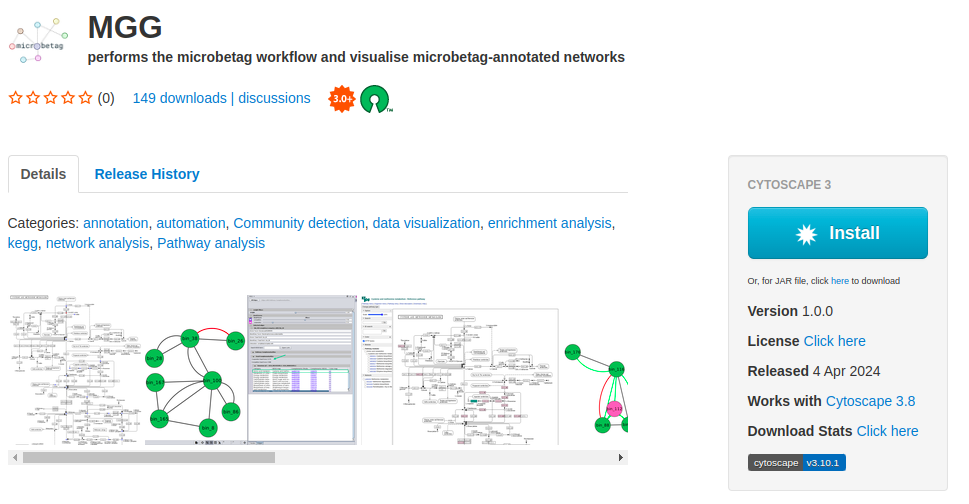
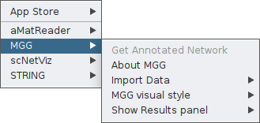

# Install `microbetag`

`microbetag` consists of several, independent tools, to allow users to get an annotated co-occurrence network 
based on their needs. 

Its basic features are the following: 

- *microbetag* Cytoscape App called MGG: no matter how you will actually run `microbetag`, you will need `MGG` to visualize the annotated network. Through MGG, you can upload your input data and directly call `microbetag` which will run on-the-fly on our server. `microbetag` wiil first try to map the taxa present on the data to their corresponding GTDB genomes based on their **taxonomies**. This case is rather straight forward for the user, but it is limited in datasets with less than 1000 taxa. 

- *microbetagDB* hosted at KU Leuven, it consists of all the pairwise GTDB reference genomes annotations. You can directly access its contents using its corresponding [API](api)

- `microbetag_prep` a Docker image that allows you to run only two specific preprocessing steps: 
  - in case of 16S rRNA data, you can provide an abundance table with the ASV/OTU on its last column and your data will be taxonomically assigned using a GTDB-oriented 16S reference database.
  - for datasets with more than 1000 taxa, you can perform the network inference using this image and the `FlashWeave` tool. 
  After, you run this pre-process image, you may provide your findings on MGG instead of your original data. This way, you can run the streamiline on-the-fly version of `microbetag` for bigger datasets. 

- `microbetag` stand-alone tool. This is the most elevated way to access `microbetag`'s features. It is the one allowing you to move beyond the precalculations of the GTDB reference genomes and the `microbetagDB`, and instead, implement our approach on your own genomes, bins/MAGs, genome annotations or even Genome Scale Models. 


## Where to get what

- `MGG` app: 
  - The app [on your Cytoscape](https://apps.cytoscape.org/apps/mgg)
  - [Source code](https://github.com/ermismd/MGG) for the app

- `microbetag_prep` tool:
  - The tool [on DockerHub](https://hub.docker.com/r/hariszaf/microbetag_prep)
  - [Source code](https://github.com/hariszaf/microbetag/tree/preprocess)

- `microbetag` stand alone: 
  - The tool [on DockerHub](https://hub.docker.com/r/hariszaf/microbetag)
  - [Source code](https://github.com/hariszaf/microbetag/)

- `microbetagDB`: 
  - [Source code](https://github.com/hariszaf/microbetag/tree/microbetagdb)
  - Key data products [on Zenodo](https://zenodo.org/records/10562677)


## Install `MGG` Cytoscape 


To start using *microbetag* and/or to visualize *microbetag*-annotated networks, you need first, to make sure you have **Cytoscape** on your system; if not, go ahead and [download Cytoscape](https://cytoscape.org/download.html). 
Then, you need to install the *microbetag* app (`MGG`) from [Cytoscape App store](https://apps.cytoscape.org/apps/mgg).
Make sure **you first launch Cytoscape** and then visit Cytoscape Appstore.
If you have already visited the MGG page on Cytoscape Appstore, **launch Cytoscape and refresh the Cytoscape Appstore page**.
You should now see an **Install** button.



By clicking it, it will be automatically integrated on your Cytoscape. 
If you visit Cytoscape Appstore and you have not lunched Cytoscape, you will see a *Download* button instead of the *Install*.
As already mentioned, we suggest you lunch Cytoscape and refresh the page. 
Otherwise, you can click the **Download** button and move manually the `.jar` file to the apps folder of your Cytoscape.

You can also get `MGG` from within Cytoscape by clicking on the `Apps` tab of the main bar and then `App  Store > Show App Store` and typing `microbetag` on the box that pops up.

Once the app is installed, you may click on the `Apps` tab, and you will find *MGG* there.




## Install `microbetg_prep` tool

The tool 

To this end, a Docker/Singularity image is available supporting the taxonomy assignment of the ASVs/OTUs with GTDB taxonomies 
[a taxonomy annotated abundance file with the 16S GTDB (v.207) taxonomies](https://zenodo.org/records/6655692) and the creation of the co-occurrence network if asked. 


[Docker](https://docs.docker.com/get-docker/) or [Singularity](https://docs.sylabs.io/guides/3.0/user-guide/installation.html) needs to be installed. 
Then, download the `microbetag_prep` image either by running: 


```bash
    docker pull hariszaf/microbetag_prep:v1.0.0
```


or 
```bash
    singularity pull docker://hariszaf/microbetag_prep:v1.0.0
```


## From source code

To install the `microbetag` stand-alone tool locally, you need first to make sure you have `conda` or `miniconda`.
If not already available, you may follow instructions [here](https://docs.anaconda.com/miniconda/).


```bash
    git clone https://github.com/hariszaf/microbetag.git

    cd microbetag

    bash setup_environment.sh
```

`microbetag` and the tools it invokes require a set of dependencies, most of which can be installed at the user level.

However, to enable the [RASTtk](https://www.bv-brc.org/docs///cli_tutorial/rasttk_getting_started.html), there are some Perl requirements that if not already available, they do require to be installed by your admin, i.e. requiring sudo rights.
Also, [gdebi](https://itsfoss.com/gdebi-default-ubuntu-software-center/) is required for installing `RASTtk`.

```{note}
The `setup_environment.sh` script will build two `conda` environments:
- one for running the phenotrex tool alone, called `phendb`
- a second for all the rest requirements and the main `microbetag` features, called `microbetag`

The software installed, e.g. Prodigal, HMMER etc, will be installed under your `$HOME`:

    cd
    ls .microbetag
    /home/my_user/.microbetag

```


```{danger}
We have noticed a weird behavior on MacOS when installing `phenotrex` locally. 
In case the `setup_environment.sh` script fails, you may try to install dependecies required on MacOS for phenotrex based on the error message you get,
and then try to continue the `microbetag` installation. 
**Remember** to install phenotrex in the `phendb` conda environment.
```


## Install `gurobi` license

If you are about to use the stand-alone `microbetag` tool, you will most probably wish to reconstruct Genome Scale Reconstructions (GENREs) based on your own genomes/bins/MAGs. 

To this end, `microbetag` wraps two widely used approaches: 

- using `modelseedpy` that required RAST annotation of your bins and are based on the [ModelSEED resource](https://modelseed.org) and identifiers. This can be a rather time-consuming step

- using `carveme` that can be performed in both DNA and protein sequences, make use of the [BiGG identifiers](http://bigg.ucsd.edu) and required a Gurobi license (see section [GEM reconstruction step](advanced_use/local.md#gem-reconstruction-step))

Both approaches benefit a lot from solvers, such as `gurobi`; `carve` actually requires one to run (either Gurobi or CPLEX).

Here is how to get a Gurobi license (for academics): 
- if you are running `microbetag` from source code
- if you are using the Dockerized version 

We found [this video](https://www.youtube.com/watch?v=oW6ma8rdZk8) (released on 2022) quite helpful on how to get a Gurobi license. 

Your license is a `gurobi.lic` file. To check that your Python can actually use the license, you may run:

```bash
    conda activate microbetag
    python
```
and then 
```python
    >>> import gurobipy as gbp
    >>> m = gurobipy.Model()
    Set parameter Username
    Academic license - for non-commercial use only - expires 2025-04-15
```

### .. on a container

When you are using `microbetag` stand-alone tool as a container, you will need a different kind of Gurobi license, 
one called **Web License Service (WLS)** [Gurobi license](https://www.gurobi.com/downloads/).

You may find the following [link](https://support.gurobi.com/hc/en-us/community/posts/4406485885841-Installing-Gurobi-on-a-Docker-container-Ubuntu) useful on how to do that.


After you get your WLS, it will be again be a `gurobi.lic` file, you need to **mount** it on the `microbetag` container.
For example, assuming you have the `gurobi.lic` file in the folder you are running the following `docker` command from:

```bash
    docker run --rm -it  \
        --volume=./tests/dev_io_microbetag/:/data \
        --volume=./microbetagDB/ref-dbs/kofam_database/:/microbetag/microbetagDB/ref-dbs/kofam_database/ \
        --volume=gurobi.lic:/opt/gurobi/gurobi.lic:ro \
        --entrypoint /bin/bash  \
        hariszaf/microbetag:v1.0.2
```

Note that `microbetag` is looking for the license under `/opt/gurobi/`.
 
