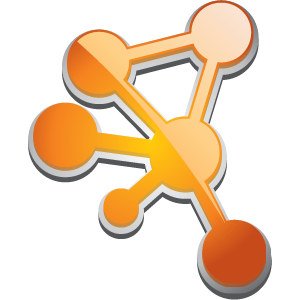

# Usage modes


## A software suite

*microbetag* is a comprehensive software suite composed of several modules, each tailored to different analytical tasks.
It includes:

*  **a Python library:**

<!-- - [](https://emoji.gg/emoji/1850-python-logo) **a Python library:**  -->

which provides functionality for key preprocessing steps and powers the core annotation pipeline; it supports `microbetag` analyses using local or custom genome sets

*  **a database (`microbetagDB`):** 

containing precomputed annotations for GTDB reference genomes

- 🌐 **a web server:**

    -  enables **on-the-fly** network annotation by mapping taxonomies from abundance data or network node names to their closest GTDB genomes
    - offers an API for programmatic access to `microbetagDB` content

-  **a Cytoscape app (`MGG`)**

offering a user-friendly interface for running `microbetag`, parsing annotated networks, and performing enrichment analyses directly within Cytoscape

-  **a `pre-process` independent module**

designed for 16S rRNA amplicon data, which performs taxonomic assignment using a GTDB-specific reference database to prepare the data for optimal downstream `microbetag` analyses


If you plan to use the on-the-fly version of microbetag, simply follow these steps:

- make sure <a href="https://cytoscape.org" target="_blank">Cytoscape</a> is installed on your system; 
  if not, download and install it from the <a href="https://cytoscape.org/download.html" target="_blank">Cytoscape Install page</a>
    
- launch Cytoscape, then visit the <a href="https://apps.cytoscape.org/apps/mgg" target="_blank">MGG Cytoscape Appstore page</a>, 
  then click the `Install` button to add the MGG app to your Cytoscape environment


To make use of other *microbetag* modules, follow their corresponding instructions on the [*Installation*](./installation.md) page.


## Running `microbetag`..

To use `microbetag`, you can choose between two main modes depending on your data and analysis goals:

### 🚀 On-the-fly

This mode runs entirely within the Cytoscape environment via the `MGG` Cytoscape App.

You begin by loading your data into Cytoscape, then use `MGG` to submit a `microbetag` job to the web server. Once submitted:

Taxa in your data are mapped to their closest GTDB representative genomes (if possible).
Precomputed information from `microbetagDB` is used to annotate your network.

```{note}
If your abundance table contains more than 1000 taxa, providing a corresponding network is required.
Also, the use of a fixed taxonomy scheme.
```

To support large-scale 16S rRNA datasets and ensure compatibility with GTDB 
(when your taxonomy is not already in Silva or GTDB format),
we provide a containerized preparation tool: 
<a href="https://hub.docker.com/r/hariszaf/microbetag_prep" target="_blank">`microbetag_prep`</a>.
Details on how to use this can be found in the [preparation tutorial](./tutorials_otf/prep.md). 
`microbetag_prep` is also available as a <a href="https://hub.docker.com/r/hariszaf/microbetag_prep" target="_blank">Docker image</a>.


### 💻 Local

In this mode, you use the `microbetag` Python library directly to annotate your data using your own genome bins or MAGs.
This option allows for complete customization and offline execution.
See the [local usage tutorial](./tutorials_local/local.md) for instructions.

To simplify the setup, we provide a <a href="https://hub.docker.com/r/hariszaf/microbetag" target="_blank">containerized version</a> 
that bundles all dependencies.
For further instructions on how to set `microbeag` locally, have a look at the [installation page](./installation.md).

❗ Running `microbetag` locally can take several hours depending on the number of genomes. 
For this reason, local execution is required for large-scale datasets.

```{note}
Once the annotation is complete, you can import and explore the annotated network (.cx2 format) 
on Cytoscape using the `MGG` App; just like in the on-the-fly version.
```


## How to

We provide tutorials to help you get started with `microbetag`, whether you're using the on-the-fly web-enabled version or running it locally with custom genome sets.

### 📌 Core Topics (Common to All Modes)

These tutorials introduce key concepts that apply to all usage modes of `microbetag`:

- Required [input files](./tutorials_core/input.md) and expected formats
- [Mandatory parameters](./tutorials_core/basic_params.md) that you may provide either through the `MGG` parameters panel
  on the on-the-fly version, or as part of your configuration YAML file for the local case.
- Features in the `MGG` Cytoscape app for [browsing annotated networks](./tutorials_core/roaming.md)
- Performing [enrichment analysis](./tutorials_core/enrichment.md) on network features


### 🚀 Using `microbetag` On-the-Fly

These tutorials guide you through using `microbetag` directly via Cytoscape and the MGG app, including:

- Firing `microbetag` [with](./tutorials_otf/from_net.md) or [without](./tutorials_otf/abd_only.md) a network file as input
- [Providing metadata](./tutorials_otf/abd_and_metadata.md) for the network inference
- Using the [`pre-process` module](./tutorials_otf/prep.md) for 16S rRNA data (to enable use of large datasets in on-the-fly mode)

### 💻 Using `microbetag` Locally

These tutorials demonstrate how to run `microbetag` on your own system:

- [Filling in the YAML configuration file](./tutorials_local/config.md) based on your data 
  and the specific tasks you want microbetag to perform.
- [Running the Python-based annotation pipeline](./tutorials_local/local.md) with custom genome collections


### 🧑‍💻 Access programmatically and/or contribute

For coding-familiar users, we also provide instructions about:

- how to use `microbetag`'s [API](./tutorials_local/local.md) to get either species specific annotations or 
  potential complementarities for species pairs from `microbetagDB`

- the [code base of `microbetag`](./autoapi/index)


