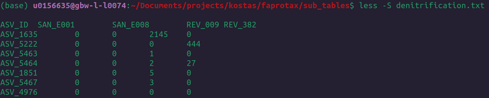
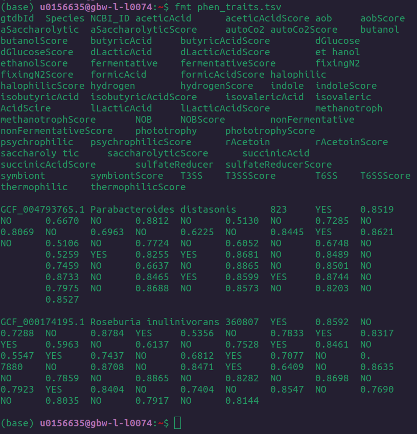
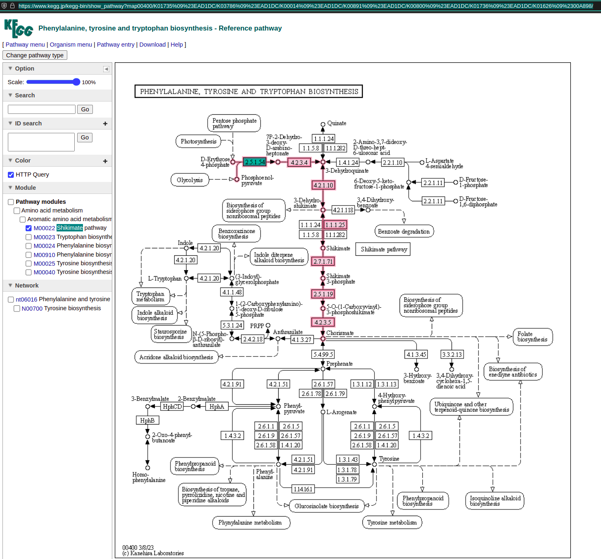
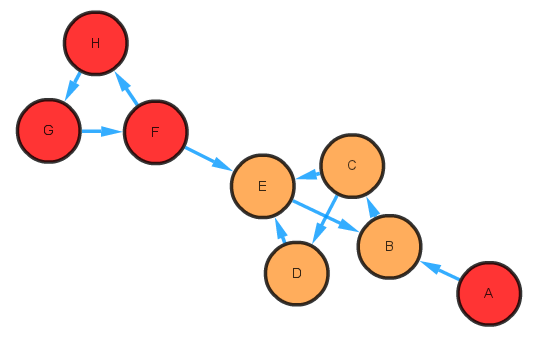
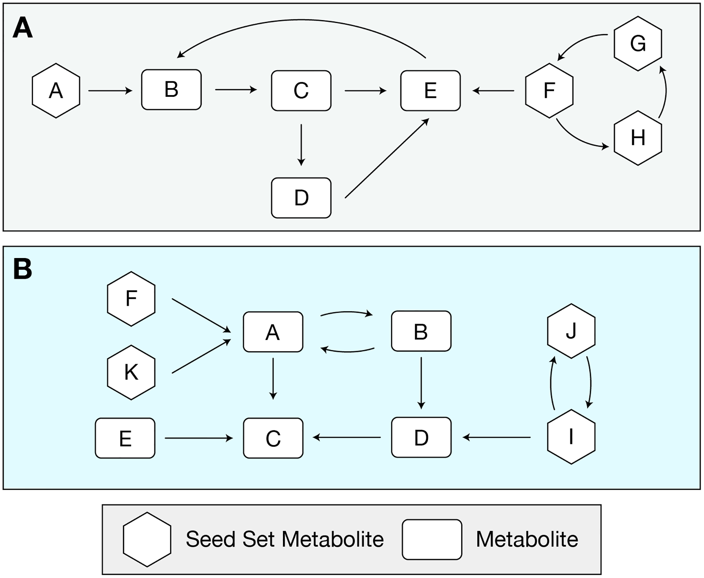
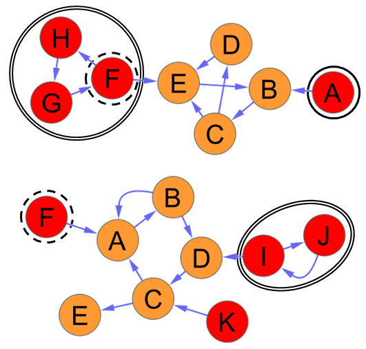

# Modules 

<!-- {: .no_toc } 
Just the Docs has some specific configuration parameters that can be defined in your Jekyll site's _config.yml file.
{: .fs-6 .fw-300 } 
-->

## Table of contents
{: .no_toc .text-delta }

1. TOC
{:toc}

---

microbetag gets as input either a co-occurrence network or an abundance table where either [Silva](https://www.arb-silva.de) or [GTDB](https://gtdb.ecogenomic.org) taxonomies have been used. 
When an abundance table is provided, microbetag firsts builds a co-occurrence network using [FlashWeave](https://github.com/meringlab/FlashWeave.jl) [1].

Once a network is availalbe, microbetag identifies the taxonomic level that has been assigned to each entry, for example 
`D_0__Bacteria; D_1__Firmicutes; D_2__Clostridia; D_3__Clostridiales; D_4__Ruminococcaceae; D_5__uncultured; D_6__uncultured rumen bacterium`
has reached the family level, while
`D_0__Bacteria; D_1__Actinobacteria; D_2__Coriobacteriia; D_3__Coriobacteriales; D_4__Coriobacteriaceae; D_5__Collinsella; D_6__uncultured bacterium`
is at the genus level.

The network annotation consists of 4 major modules: 

- **literature oriented** taxa funcitonal annotation using [**FAPROTAX**](https://pages.uoregon.edu/slouca/LoucaLab/archive/FAPROTAX/lib/php/index.php) [2]
- **genomic oriented** functional annotation using an updated, local instance of [**phenDB**](https://phendb.org) using all representative genomes of GTDB and [`phenotrex](https://phenotrex.readthedocs.io/en/latest/usage.html)
- **pathway complementarity** annotations between taxa have been found co-correlated; both taxa ara considered as potential donor and beneficiary (see [Pathway complementarity: an example](#pathway-complementarity-an-example) for more)
- **complementarity** [3] and **competition** [4] **seed scores** between draft metabolic reconstructions of GTDB representative genomes, mapped to the input taxa using [**PhyloMint**](https://github.com/mgtools/PhyloMint) (see [Seed-based complementarity and competition scores]() for more) 

FAPROTAX returns annotations for taxa (nodes) that they have been taxonomically annotated at the family or even at the order level in some cases, while the other 3 annotation types 
return annotations only at the strain and the species level.
**Nodes** that have species or strain taxonomic annotation are mapped to their closest representative GTDB genomes and based on those, they get phenDB-like functional annotations. 
**Edges** linking nodes that have been assigned at the species or strain level, i.e. both nodes of the association have a species/strain taxonomic annotation, are annotated using 
the pathway complementarity and the seed scores approaches. 

Below, you will find further background and examples of each annotation type. 

## Functional annotations

### Based on FAPROTAX

[**FAPROTAX**](https://pages.uoregon.edu/slouca/LoucaLab/archive/FAPROTAX/lib/php/index.php) [2] maps taxa (e.g. genera or species) 
to metabolic or other ecologically relevant functions based on the literature on cultured representatives. 
It currently comprises more than 7600 annotation rules, covering ~4700 prokaryotic clades. 
Each annotation rule comes with literature citations and can thus be independently verified.
16S rRNA oriented approaches (e.g., PICRUSt, Tax4Fun etc) estimate community gene content based on available sequenced genomes.
Contrary, FAPROTAX estimates metabolic phenotypes based on experimental evidence.

The taxonomy assigned to each OTU/ASV (amplicon data) or bin (shotgun data) on the abundance table provided by the user, is mapped to a list of functions one can check [here](faprotax-functions.md).

As an example, here is how the FAPROTAX outcome looks like for the case of **denitrification** function: 

All ASVs present in this file are related to the **denetrification** function.
Numbers represent the ASV abundance in each sample. 

microbetag runs FAPROTAX agains the abundance table and parses the subtables ([`seqId_faprotax_functions_assignment`](https://github.com/msysbio/microbetagApp/blob/main/services/web/microbetag/scripts/utils.py#L181)) 
to annotate each node with the corresponding function. 

### Based on phenDB 

[`phenotrex`](https://phenotrex.readthedocs.io/en/latest/usage.html) 
enables phenotypic trait prediction on user's metagenomic genomes/bins etc.

Phenotrex classifiers were re-trained using the genomes provided by phenDB for each model. 
For example, for the acetic acid production case, the [corresponding webpage of phenDB](https://phendb.org/reports/modeldetails?model_id=16) pointed to the set of genomes that had been originally used. 
These genomes were recovered and the classifiers were re-trained using 

Under the [Traits predicted based on phenDB models](phen-traits.md) tab, we provide a description of each feature abbreviation, based on those from the [phenDB group](https://phendb.org/reports/modeloverview). 

The annotation is referring to the species under study. 
Each trait gets a "Yes" or "No" decision along with an accurracy score. 
For example `NOB` : *species under study is part of the clade of NOB*. 

Here is an example of how 2 GTDB genomes look like: 

microbetag annotates with these functional traits along with their scores, all network nodes that correspond 
to OTUs/ASVs or bins that have been assigned to species/strain level and mapped to a representative GTDB genome.

## Pathway complementarity: an example

As defined by the [KEGG resource](https://www.genome.jp/kegg/module.html), "the KEGG MODULE database is a manually curated collection of modular functional units, categorized into pathway modules, signature modules and reaction modules".

All the GTDB representative genomes were KEGG annottated. 
Considering all pair-wised combinatons of those genomes, microbetag checks whether the KO terms of a genome (donor), 
if shared, could complete a KEGG module of another (beneficary).

Here is an example where Acidiferrobacter sp. SPIII3 
(GCA_003184265.1) potentially shares K01626 to complete the Shikimate pathway (M00022) of
Prochlorococcus marinus AS9601 (GCA_000015645.1).

{: width=80% }

As several genomes can be mapped to the same NCBI Taxonomy id, microbetag returns all possible complementarities
between all the donor's and the beneficary's genomes. 

microbetag annotates with such complementarities all edges where both nodes represent species/strain level taxonomies.

## Seed scores based on genome-scale draft reconstructions 

Based on Borenstein *et al.* (2008) [5] a metabolic network's “seed set”—the set of compounds that, based on the network topology, are exogenously acquired".
Here is an example (based on the [Borensteil lab webpage](http://borensteinlab.com/software_netseed_examples.html)):

Node A is a seed, as it cannot be activated by any other node in the network.
Nodes F, G, and H are also seeds but they are interdependent, i.e. activating one of these nodes 
would activate the rest, but at least one must be active to activate the rest. 
These nodes form a "seed group".
To quantify the relevance of each identified seed, we assign each seed a **confidence level (C)**, ranging from 0 to 1. 
A confidence level of 0 would correspond to a non-seed node, while a 1 would correspond to a seed that cannot be activated by another node. Seeds which belong to a seed group with more than 1 seed are given a fractional confidence level, the inverse of the number of seeds in the group. 
<!-- Nodes F, G, and H would then each have a confidence level of 1/3. -->

Based on the seed concept, several scores between metabolic models of pair of species have been described. 
As described in the PhyloMint papaer: the **Metabolic Complementarity Index** ($$ MI_{Complementarity} $$) is calculated as the *"fraction of the seed set of the genome-scale reconstruction of species A, that is found within B’s metabolic network but not part of B’s seed set, normalized by the number of A’s seed set in B’s entire metabolic network"*. 
This complementarity score represents the **potential for A’s to utilize the potential metabolic output of B**.

$$ 
MI_{Complementarity} = \frac {\lvert SeedSetA \bigcap \neg SeedSetB \rvert} {\sum SeedSetA \bigcap (SeedSetB \cup \neg SeeedSetB)}
$$

Similarly, as described in the PhyloMint paper, the **Metabolic Competition Index** ($$MI_{Competition}$$)
*"is calculated as the fraction of A’s seed set that is also in B’s seed set, normalized by the weighted sum of the confidence score"*.
MIC estimates the baseline **metabolic overlap** between two given metabolic networks.

$$ 
MI_{Competition} = \frac {\sum C( SeedSetA \bigcap SeedSetB )} {\sum C(SeedSetA)}
$$

Here is a toy example to calculate the two indices as shown in the PhyloMint paper:

<!-- In metabolic pathway A, SeedSetA consists of metabolites A, F, G, and H; 
metabolites F, G, and H form a seed group. 
Confidence level of seed set metabolites within metabolic network A is $1$, $1/3$, $1/3$, and $1/3$ for metabolites A, F, G, and H, respectively. 
In metabolic pathway B, SeedSetB consist of F, I, J, and K; metabolites I and J form a SCC. 
Confidence level of seed set metabolites within metabolic network B is 1, $1/3$, $1/3$, and 1 for metabolites F, I, J, and K, respectively.  -->
In a comparison between metabolic network A versus metabolic network B, metabolic network A shares only one seed metabolite with metabolic network B (metabolite F) which lies in the seed group in metabolic network A. 
Thus, the $$MI_{Competition}$$ between metabolic network A and B is $$(1/3) / 2 = 1/6$$. 

{: .highlight }
The $$1/3$$ term represents the confidence level of the seed group node. 

Among SeedSetA, metabolites A and F are found within the metabolic network B but only metabolite A is within non-SeedSetB, thus the MIComplementarity index between metabolic network A and metabolic network B is 0.5.

These indexes can be used in various types of metabolic networks. 
microbetag 

<!-- 

In this example, we have a pair of simple networks. The top network has two seed groups, one of size one and the other size three (circled with a double line). The bottom network has three seed groups, two singletons, and one two-node seed group (circled with a double line). Seeds of one network present in the other are circled (solid lines: present, but not a seed of, the second network; dashed lines: present as a seed of the second network). The Biosynthetic Support Score of the top network on the bottom (i.e. treating the top as a parasite of the bottom) is 1.0. Note that all seed groups (but not all seeds) are present in the bottom network, and that node F is a seed of both networks. The Metabolic Complementarity Index of the top network on the bottom (i.e. treating both networks as co-occurring microbes) is 0.5. Because node F is a seed of the bottom network, it is not complementary to the top network’s seed set. -->

## References

[1] Tackmann, J., Rodrigues, J.F.M. and von Mering, C., 2019. Rapid inference of direct interactions in large-scale ecological networks from heterogeneous microbial sequencing data. Cell systems, 9(3), pp.286-296, DOI: [10.1016/j.cels.2019.08.002](https://doi.org/10.1016/j.cels.2019.08.002).

[2] Louca, S., Parfrey, L.W., Doebeli, M. (2016) - Decoupling function and taxonomy in the global ocean microbiome. Science 353:1272-1277, DOI: [10.1126/science.aaf4507](https://doi.org/10.1126/science.aaf4507).

[3] Levy, R., Carr, R., Kreimer, A., Freilich, S., Borenstein, E. "NetCooperate: a network-based tool for inferring host-microbe and microbe-microbe cooperation." BMC Bioinformatics, 2015.

[4] Kreimer, A., Doron-Faigenboim, A., Borenstein, E., Freilich, S. "NetCmpt: a network-based tool for calculating the metabolic competition between bacterial species." Bioinformatics, 2012.

[5] Borenstein, E., Kupiec, M., Feldman, M.W. and Ruppin, E., 2008. Large-scale reconstruction and phylogenetic analysis of metabolic environments. Proceedings of the National Academy of Sciences, 105(38), pp.14482-14487.

