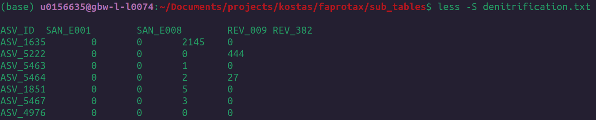
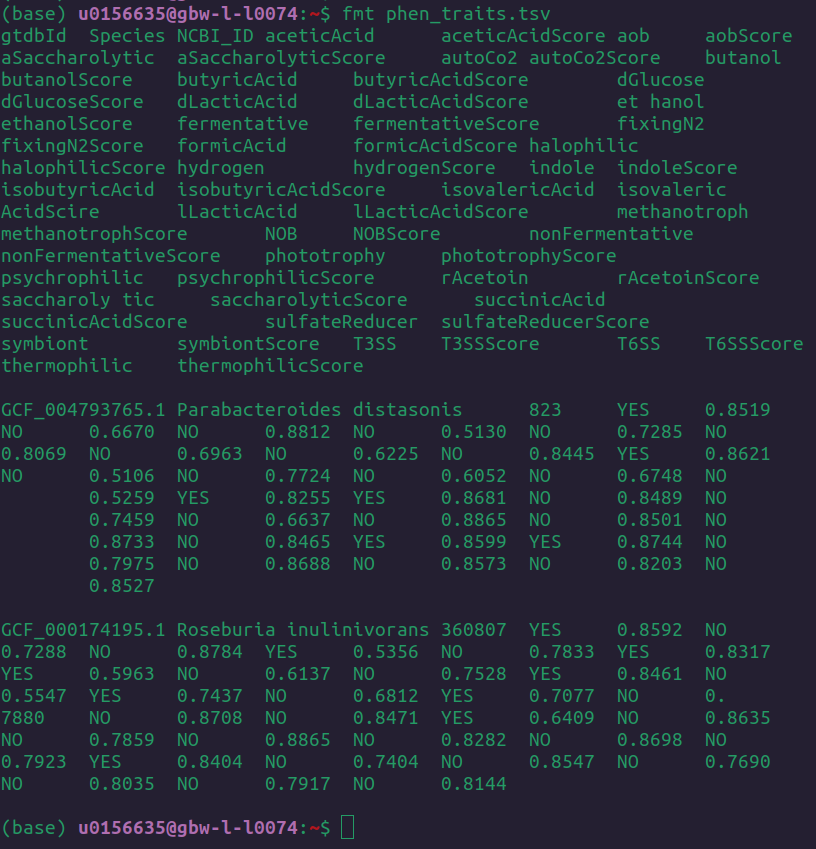
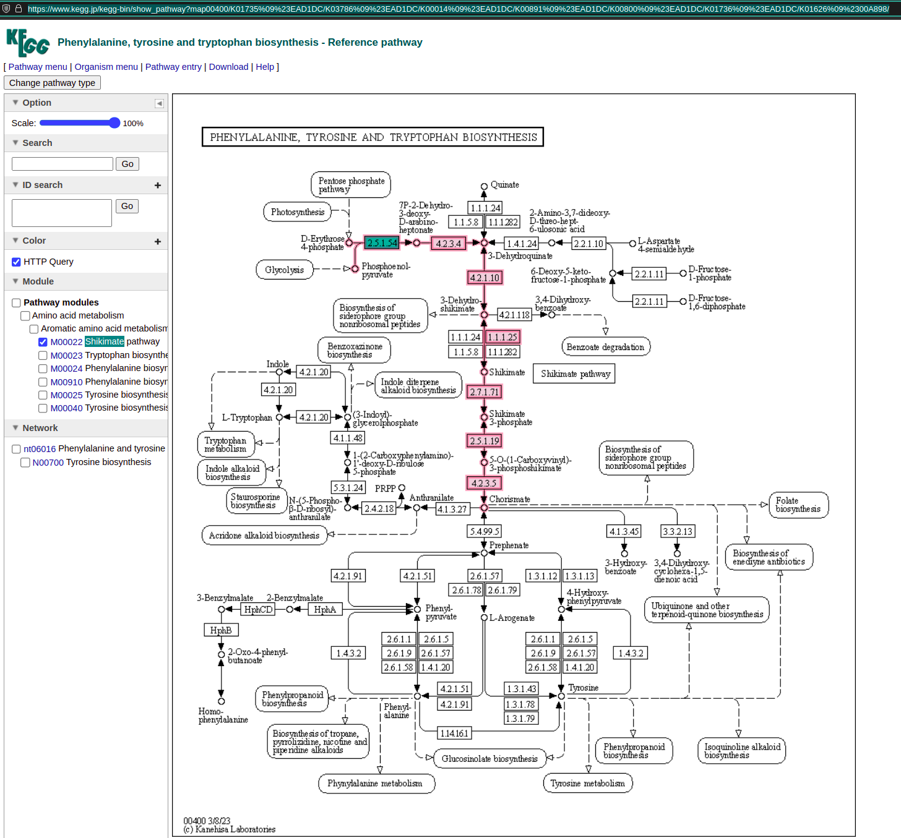
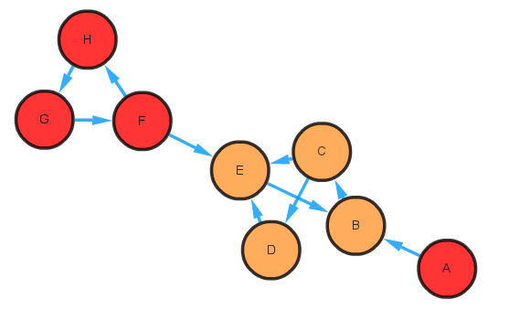
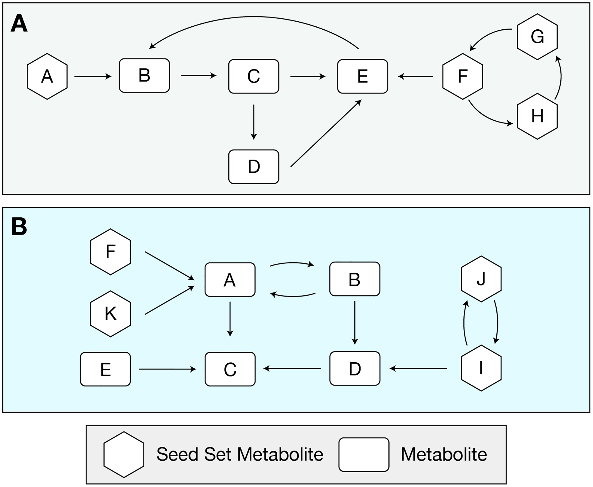
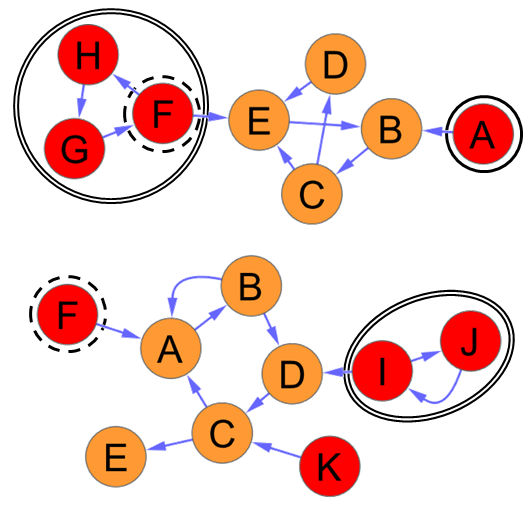

# Modules


## Overview

`microbetag` gets as input either a co-occurrence network or an abundance table 
where either <a href="https://www.arb-silva.de" target="_blank">Silva</a> or 
<a href="https://gtdb.ecogenomic.org" target="_blank">GTDB</a> taxonomies have been used. 
When an abundance table is provided, *microbetag* first builds a co-occurrence network 
using <a href="https://github.com/meringlab/FlashWeave.jl" target="_blank">FlashWeave</a> {cite:p}`tackmann2019rapid`.


Once a network is available, `microbetag` identifies the taxonomic level that has been assigned to each entry, 
for example 

`D_0__Bacteria; D_1__Firmicutes; D_2__Clostridia; D_3__Clostridiales; D_4__Ruminococcaceae; D_5__uncultured; D_6__uncultured rumen bacterium`

has reached the family level, while

`D_0__Bacteria; D_1__Actinobacteria; D_2__Coriobacteriia; D_3__Coriobacteriales; D_4__Coriobacteriaceae; D_5__Collinsella; D_6__uncultured bacterium`

is at the genus level and proceeds with the network annotation. 


The network annotation consists of 4 major modules: 

- **literature oriented** taxa functional annotation using 
  <a href="https://pages.uoregon.edu/slouca/LoucaLab/archive/FAPROTAX/lib/php/index.php" target="_blank">**FAPROTAX**</a>
  {cite:p}`louca2016decoupling`

- **genomic oriented** taxa functional annotation using an updated, local instance of 
  <a href="https://phendb.org" target="_blank">**phenDB**</a> using all representative genomes of GTDB and 
  <a href="https://phenotrex.readthedocs.io/en/latest/usage.html" target="_blank">`phenotrex`</a> 
  {cite:p}`feldbauer2015prediction`

- **pathway complementarity** annotations between taxa that have been found co-correlated in the produced 
  (or user provided) network; both taxa were considered as potential donor and beneficiary 
  (see [Pathway complementarity](#pathway-complementarity) for more)

- **complementarity** {cite:p}`levy2015netcooperate` 
  and **competition** {cite:p}`kreimer2012netcmpt` 
  **seed scores** between draft metabolic reconstructions of GTDB representative genomes, 
  mapped to the input taxa using <a href="https://github.com/mgtools/PhyloMint" target="_blank">**PhyloMInt**</a>
  (see [Seed-based complementarities and scores](#seeds-complementarity) for more)

**Nodes (taxa)** that have species or strain taxonomic annotation are mapped to their closest representative GTDB genomes 
and based on those, they get `phenotrex`-based and FAPROTAX functional annotations. 
Taxa that have been taxonomically annotated at the family or order level are annotated using FAPROTAX only.

**Edges (taxa associations)** linking nodes that have been taxonomically assigned at the species or strain level, 
i.e. both nodes of the association have a species/strain taxonomic annotation, 
are annotated using the pathway complementarity and the seed scores approaches. 

Below, you will find further background and examples of each annotation type. 


## Functional annotations


### 📚 Based on literature


<a href="https://pages.uoregon.edu/slouca/LoucaLab/archive/FAPROTAX/lib/php/index.php" target="_blank">**FAPROTAX**</a> 
{cite:p}`louca2016decoupling` 
maps taxa (e.g. genera or species) to metabolic or other ecologically relevant functions 
based on the literature for cultured representatives.
It currently comprises more than 7600 annotation rules, covering ~4700 prokaryotic clades.
Each annotation rule comes with literature citations and can, thus, be independently verified.
Similar 16S rRNA oriented approaches (e.g., PICRUSt, Tax4Fun etc.) estimate community gene content based on available sequenced genomes. On the contrary, FAPROTAX estimates metabolic phenotypes based on experimental evidence.

The taxonomy assigned to each OTU/ASV (amplicon data) or bin (shotgun data) on the abundance table provided by the user, is mapped to a list of functions one can check [here](faprotax-functions.md).

As an example, here is how the FAPROTAX output looks like for the **denitrification** function for three samples (columns): 




FAPROTAX returns only the ASVs present in the (user provided) abundance table 
that are related to the **denetrification** function.
Numbers represent the ASV abundance in each sample. 

`microbetag` runs FAPROTAX against the abundance table and parses the sub-tables 
(an <a href="https://github.com/hariszaf/microbetag/tree/user-bins/tests/dev_io_microbetag/microbetag_run/faprotax/sub_tables" target="_blank">example</a>) 
to annotate each node with the corresponding function. 

In case the user provides as input a co-occurrence network, `microbetag` runs FAPROTAX against the nodes.


### 🧬 Based on genome-derived predictions

<a href="https://phenotrex.readthedocs.io/en/latest/usage.html" target="_blank">`phenotrex`</a>
enables phenotypic trait prediction on user's metagenomic genomes/bins.

`phenotrex` classifiers were re-trained using the genomes provided by phenDB for each model. 
For example, for the acetic acid production case, 
the <a href="https://phendb.org/reports/modeldetails?model_id=16" target="_blank">corresponding webpage of phenDB</a> 
pointed to the set of genomes that had been originally used. 
These genomes were recovered and the classifiers were re-trained to sync with the latest version of 
<a href="http://eggnog5.embl.de/#/app/home" target="_blank">eggNOG</a>.

Under the [Traits predicted based on phenDB models](phen-traits.md) tab, 
we provide a description of each feature abbreviation returned from microbetag based on phen feautures, 
based on those from the <a href="https://phendb.org/reports/modeloverview" target="_blank">phenDB group</a>. 


The annotation is referring to the species under study. 
Each trait gets a "Yes" or "No" decision along with an accuracy score. 
For example `NOB` : *species under study is part of the clade of NOB*. 

Here is an example of how two GTDB genomes look like: 




_microbetag_ annotates all network nodes 
(corresponding to OTUs/ASVs/bins that have been identified to species/strain level) 
mapped to a representative GTDB genome with these functional traits and scores.


## Metabolic complementarities

_microbetag_ supports two main approaches for predicting potential metabolic interactions between two taxa, both based on the concept of complementarity. In this context, a potential beneficiary species receives a metabolite from a potential donor—a compound it cannot produce on its own but can utilize to support downstream metabolic pathways.

_microbetag_ supports two main approaches for predicting **potential** metabolic interactions between two taxa, 
both based on the concept of _complementarity_.  
In this context, a potential **beneficiary** species receives a metabolite from a potential **donor**,
a compound it cannot produce on its own but can utilize to support downstream metabolic pathways.


## 🧩 Pathway complementarity


As defined by the <a href="https://www.genome.jp/kegg/module.html" target="_blank">KEGG resource</a>, 
*"the KEGG MODULE database is a manually curated collection of modular functional units,* 
*categorized into pathway modules, signature modules and reaction modules"*.

All the GTDB representative genomes were KEGG annotated. 
Considering all pair-wised combinations of those genomes, 
_microbetag_ checks whether the KEGG Orthology (KO) terms of a genome (donor) could complete a KEGG module 
of another (beneficiary), if shared.

Here is an example where *Acidiferrobacter* sp. SPIII3 
(<a href="https://gtdb.ecogenomic.org/genome?gid=GCA_003184265.1" target="_blank">GCA_003184265.1</a> ) 
potentially shares K01626 to complete the Shikimate pathway 
(<a href="https://www.genome.jp/dbget-bin/www_bget?M00022" target="_blank">M00022</a>) of
*Prochlorococcus marinus* AS9601 
(<a href="https://gtdb.ecogenomic.org/genome?gid=GCF_000015645.1" target="_blank">GCA_000015645.1</a>).



As several genomes can be mapped to the same NCBI Taxonomy ID, 
_microbetag_ returns all possible complementarities between all the donor's and the beneficiary's genomes. 

*microbetag* annotates all **edges** where **both nodes represent species/strain level taxonomies** with such complementarities.


 <!-- style="width: 20px; height: 20px;" -->
##  Seeds complementarity

**Seed scores and complements based on genome-scale draft reconstructions (GEMs)**


Based on Borenstein *et al.* (2008) {cite:p}`borenstein2008large`:

```{important}
we call a metabolic network's ***seed set** ($SeedSet$), the 
minimal subset of the occurring compounds that cannot be synthesized from other compounds in the network 
(and hence are exogenously acquired) 
and whose existence permits the production of all other compounds in the network
```

Here is an example (based on the 
<a href="https://borensteinlab.sites.tau.ac.il/items-1/netseed" target="_blank">Borenstein lab webpage</a>):




Node *A* is a seed, as it cannot be activated by any other node in the network.
Nodes *F*, *G*, and *H* are also seeds, but they are interdependent, 
i.e. activating one of these nodes would activate the rest, 
but at least one must be active to activate the rest. 
These nodes form a ***seed group***.

To quantify the relevance of each identified seed, we assign each seed a **confidence level ($C$)**, 
ranging from 0 to 1. 
A confidence level of 0 would correspond to a non-seed node, 
while a 1 would correspond to a seed that cannot be activated by another node.
Seeds which belong to a seed group with more than 1 seed are given a fractional confidence level, 
the inverse of the number of seeds in the group.
<!-- Nodes F, G, and H would then each have a confidence level of 1/3. -->

Based on the seed concept, several scores between metabolic models of pairs of species have been described. 

As described in the PhyloMInt paper, and using the corresponding GEMs of species $species_A$ and $species_B$: 

```{important}
**Metabolic Complementarity Index** ($MI_{Complementarity}$) 

The fraction of the seed set of $species_A$, that is found within $B$’s metabolic network 
but not part of $B$’s seed set, 
normalized by the number of $A$’s seed set in $B$’s entire metabolic network.

$$ 
MI_{Complementarity} = \frac {\lvert SeedSetA \cap \neg SeedSetB \rvert} { SeedSetA \cap (SeedSetB \cup \neg SeeedSetB)}
$$

> **$MI_{Complementarity}$ represents $A$’s potential to make use of $B$'s potential metabolic output**.
```


Similarly: 


```{important}
**Metabolic Competition Index** ($MI_{Competition}$)

The fraction of $A$’s seed set that is also part of $B$’s seed set, 
normalized by the weighted sum of the confidence score.

$$ 
MI_{Competition} = \frac {\sum C( SeedSetA \cap SeedSetB )} {\sum C(SeedSetA)}
$$


> **$MI_{Competition}$ estimates the baseline **metabolic overlap** between two given metabolic networks.**
```


Here is a toy example to calculate the two indices as shown in the PhyloMInt paper:



Figure from the <a href="https://doi.org/10.1371/journal.pcbi.1007951.g006" target="_blank">PhyloMInt paper</a>.
<!-- In metabolic pathway A, SeedSetA consists of metabolites A, F, G, and H; 
metabolites F, G, and H form a seed group. 
Confidence level of seed set metabolites within metabolic network A is $1$, $1/3$, $1/3$, and $1/3$ for metabolites A, F, G, and H, respectively. 
In metabolic pathway B, SeedSetB consist of F, I, J, and K; metabolites I and J form a SCC. 
Confidence level of seed set metabolites within metabolic network B is 1, $1/3$, $1/3$, and 1 for metabolites F, I, J, and K, respectively.  -->
In a comparison between metabolic network $A$ versus metabolic network $B$, 
metabolic network $A$ shares only one seed metabolite with metabolic network $B$ (metabolite _F_) 
which lies in the seed group in metabolic network $A$. 

Thus, the 
$ MI_{Competition} $
between metabolic network $A$ and $B$ is 
$ (1/3) / 2 = 1/6 $. 

```{hint}
The $ 1/3 $ term represents the confidence level of the seed group node. 
```
Among $ SeedSetA $, 
metabolites _A_ and _F_ are found within the metabolic network B but only metabolite _A_ is within 
$ \cap SeedSetB $, 
thus the 
$ MI_{Complementarity} $ 
index between metabolic network $A$ and metabolic network $B$ is 0.5.
These indexes can be used in various types of metabolic networks. 

In the framework of _microbetag_, all GTDB representative genomes were used to come up 
with draft genome-scale reconstructions using 
<a href="https://github.com/ModelSEED/ModelSEEDpy" target="_blank">`modelseedpy`</a>
with its default gapfilling algorithm and a complete medium. 
Then, all GEMs pair-wised combinations were considered and using 
<a href="https://github.com/mgtools/PhyloMint" target="_blank">`PhyloMInt`</a>
their 
$ MI_{Complementarity} $ 
and 
$ MI_{Competition} $ 
scores were calculated. 
_microbetag_ annotates all **edges** between species/strain level taxonomically assigned nodes with such scores, 
considering all the representative GTDB genomes mapping to the corresponding NCBI Taxonomy Ids of the nodes.

_microbetag_ makes use of the seed and the non-seed 
(i.e., compounds a genome can produce on its own) sets of each genome and gets the overlap 
of the seed set of $genome_A$ with the non-seed set of $genome_B$. 
This way, it exports how $species_B$ could benefit $species_A$ and vice-versa.
Seed and non-seed sets were first exported as sets of ModelSEED compounds, 
since GEMs were constructed using ModelSEED.
Then, compounds were mapped to KO terms and only those participating in KEGG modules were considered for the overlap analysis.
The effect of such a metabolic interaction for $species_A$ can be visualized through KEGG maps that visualize relative pathways. 
For example, in the following map we see that O-Acetyl-L-serine can be provided and support an alternative way to the beneficiary species for producing L-cysteine.


<!-- 

In this example, we have a pair of simple networks. The top network has two seed groups, one of size one and the other size three (circled with a double line). The bottom network has three seed groups, two singletons, and one two-node seed group (circled with a double line). Seeds of one network present in the other are circled (solid lines: present, but not a seed of, the second network; dashed lines: present as a seed of the second network). The Biosynthetic Support Score of the top network on the bottom (i.e. treating the top as a parasite of the bottom) is 1.0. Note that all seed groups (but not all seeds) are present in the bottom network, and that node F is a seed of both networks. The Metabolic Complementarity Index of the top network on the bottom (i.e. treating both networks as co-occurring microbes) is 0.5. Because node F is a seed of the bottom network, it is not complementary to the top network’s seed set. -->


## References
<!-- https://sphinxcontrib-bibtex.readthedocs.io/en/latest/usage.html -->
<!-- alpha : locally works and it's the one they use in math papers e.g [MILO20] -->
```{bibliography}
:style: unsrt
```


```{toctree}
:maxdepth: 2
:caption: Modules

phen-traits
faprotax-functions
