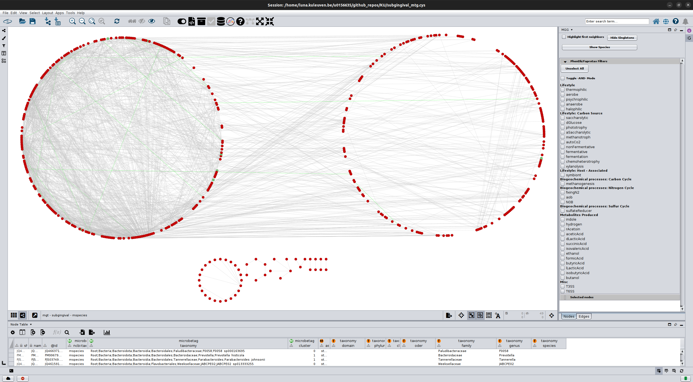
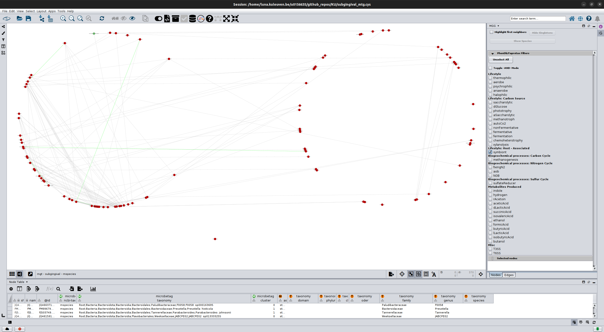
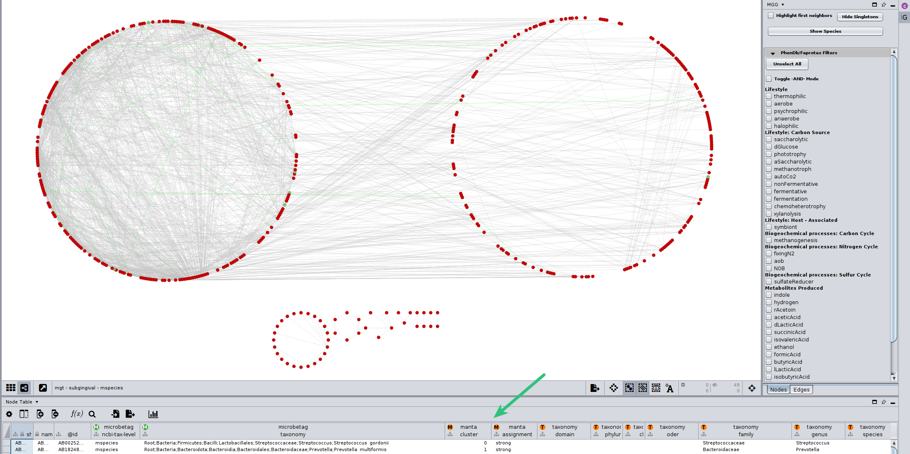
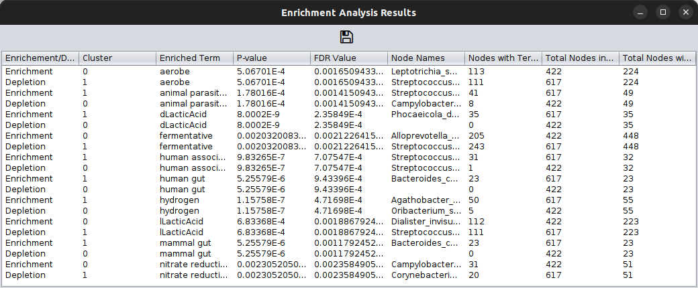
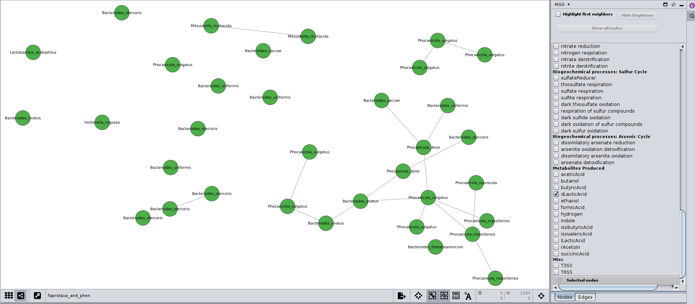

Enrichment analysis 
===================

The `MGG` Cytoscape App of ours enables enrichment/depletion analysis of the `microbetag` annotated network 
at the nodes level. 
This means that you can test whether the nodes (taxa) of a cluster are enriched with phenotypic traits assigned to them based on
[genomic-based predictions using `phenotrex`](../modules/phen-traits.md), 
and or [FAPROTAX](../modules/faprotax-functions.md).

In this tutorial, we use the *microbetag*-annotated network derived from the example case 
for [running *microbetag* with big datasets](../tutorials_otf/large_data.md) 
that makes use of the Qiita publically available dataset from the 
<a href="https://qiita.ucsd.edu/study/description/1928" target="_blank">HMP</a>.

But first, let's have some basics on enrichment analysis.

## Background and `MGG` implementation 

The goal of enrichment analysis is to determine whether specific traits are overrepresented in an experimentally derived set/list; 
for example, whether specific biological functions or processes are overrepresented in an experimentally derived gene list, as described in a tutorial by 
<a href="https://rpubs.com/jrgonzalezISGlobal/enrichment" target="_blank">*Juan R Gonzalez* in RPubs</a>.
Likewise, a trait may be depleted in a cluster, compared to the others. 


To perform such an enrichment/depletion analysis, `MGG` implements enrichment in two steps. 
First, we search for traits found differentially present among clusters. 
Second, we assess whether these traits are overrepresented in the cluster, exceeding the proportion expected by chance.
A straightforward way to assess this hypothesis consists of applying a hypergeometric test, which in fact corresponds to the <a href="https://en.wikipedia.org/wiki/One-_and_two-tailed_tests" target="_blank">one-tailed</a> 
<a href="https://en.wikipedia.org/wiki/Fisher%27s_exact_test" target="_blank">Fisher's exact test</a>.

As described in the *Gonzalez* tutorial, 
*a hypergeometric test assesses whether a number of successes in a sequence of draws follows a hypergeometric distribution*. 
The 
<a href="https://en.wikipedia.org/wiki/Hypergeometric_distribution" target="_blank">hypergeometric distribution</a> 
is a discrete probability distribution that describes the number of successes in a sequence of draws from a finite population without replacement, just as the binomial distribution describes the number of successes for draws with replacement. 

Adjusted in the microbetag framework, this involves the following quantities:

|	                   | enriched traits   | non-enriched traits  | total   |
|:------------------:|:-----------------:|:--------------------:|:-------:|
| Within cluster     | $k$	             | $m-k$	              | $m$     |
| Outside cluster    | $n-k$             | $N+k-n-m$            | $N-m$   |
| total nodes        | $n$	             | $N-m$	              | $N$     |

where:

- $N$: is the total number of taxa (nodes) considered
- $n$: is the number of taxa found with the trait.
- $m$: is the number of taxa in the cluster.
- $k$: is the number of taxa with the trait in the cluster.

Based on these counts, `MGG` makes use of the 
<a href="https://hipparchus.org/apidocs-1.4/org/hipparchus/distribution/discrete/HypergeometricDistribution.html" target="_blank">`HypergeometricDistribution`</a> 
class to get the probability distribution and the corresponding p-values:


```java
HypergeometricDistribution distribution = new HypergeometricDistribution(totalNodes, totalNodesWithPropertyX, totalNodesInCluster);

double pValForEnrichment = 1 - distribution.cumulativeProbability(nodesWithPropertyXInCluster - 1);

```

and, supports two approaches for calculating the False Discovery Rate:

- <a href="https://www.statisticshowto.com/probability-and-statistics/statistics-definitions/post-hoc/#MoreBo" target="_blank">Bonferroni</a>: 
  more conservative, reducing false positives but increases false negatives ( $\frac {\alpha} {m}$, where $\alpha$ is the required
  significance level, and $m$ the number of total tests. 
  Example: if you perform 100 tests, and you have a threshold of 0.05, then only tests with a p-value $\leq 0.05/100 = 0.0005$ will be considered significant.  <!-- family wise error rate actually not fdr -->
- <a href="https://www.statisticshowto.com/benjamini-hochberg-procedure/" target="_blank">Benjamini - Hochberg</a>: less conservative, best for explorative analyses. It ranks the p-values and then adjusts the p-value by applying:
    $ p_{adj} = p_i * \frac{m}{rank(i)}  $. Thus, it may allow some false positives, but allows more discoveries while controlling the expected proportion of false positives.


## How-to 

After performing `microbetag` having enabled the network clustering step (using `manta`), we ended up with a network that 
besides the FAPROTAX and phenDB-like annotations, it also splits its nodes to 2 big clusters.



In the figure above, all nodes on the *left "circle"* have been assigned to cluster `0` while all those on the *right "circle* and those 
below them, have been assigned to cluster `1`.

Through `MGG` we may check/uncheck one or more of their annotations. For example, by clicking on the `symbiont` box, one can see which nodes have been annotated with this term across the network:



However, we need **statistics** to check whether a cluster has more nodes (taxa) annotated with a trait compared to the other ones.


In the `Nodes table` of Cytoscape, you can find its corresponding column, called `manta::cluster`.



```{note}
<a href="https://github.com/ramellose/manta" target="_blank">`manta`</a> uses a diffusion-based proccess 
to carry out network clustering, and you may find 
more on how it works and its findings at this 
<a href="https://ramellose.github.io/manta/demo_manta.html" target="_blank">demo case</a>. 
However, there is a great range of network clustering algorithms you could go for. 
In all cases, once you cluster your network, each node will be assigned to a cluster. 
Several clustering results can be applied to the same network.
Apparently though, **only one at a time** can be used for the enrichment/depletion test.
```

To proceed to the `MGG` enrichment/depletion analysis, 
you need to **rename** your cluster-assigned column, so it is under the `microbetag` namespace.
For example, assuming you wish to use the `manta` clusters as returned from running `microbetag`, 
you would rename the `manta::cluster` column (as shown in the figure above), to `microbetag::cluster`. 


Now, by clicking again on the `Apps` tab, you may use the `MGG Enrichment` feature. 

 


You can also set which FDR method to use and its corresponding p-value threshold.


After setting which static to use, you can fire the enrichment/depletion test by clicking `Ok`. This will return a pop-up table 




Notably, `microbetag` was able to find statistically significant changes between the two clusters, with cluster 1 being enriched with several terms, 
among them *acetic acid* and *D-lactic acid*, meaning cluster 1 was enriched in taxa producing those compounds.  


So, let's have a look now on how the taxa producing *lactic acid* distribute between the two clusters:




It seems that only taxa from cluster 1 are lactic acid producers (not shown in the figure, but one could tell from its corresponding node table after selecting the nodes shown),
and most of them belong to the *Bacteroides* genus. 
The multiple presence of some species, e.g. *Bacteroides ovatus*, and their occasional positive co-occurrence, denotes that more than 1 OTUs per sample where assigned to those taxonomies,
meaning there could be several strains of that species. 
Of course, there are other reasons for this too, e.g. sequencing, clustering artifacts (see also 
<a href="https://forum.qiime2.org/t/what-is-the-reason-why-there-are-multiple-otu-identifiers-in-the-same-species-taxonomy-assignments-in-qiime/3309" target="_blank">here</a>
). 


```{hint}
In the [`large_data_session.cys`](../_static/download/large_dataset/large_data_session.cys) you may find the total networks we used for this tutorial, step-by-step. 
All you have to do is to download it and then from Cytoscape, click `File > Open Sessiion...` and select the `large_data_session.cys` file.
```


