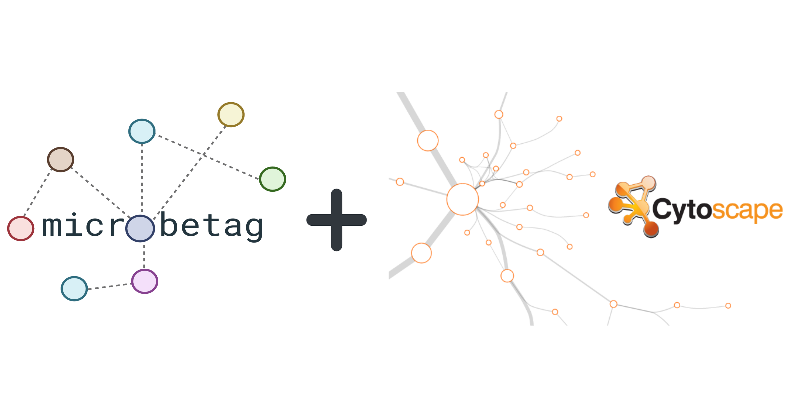

# `microbetag` on Cytoscape





<div style="display: flex; gap: 10px;">
    <br><br>  
   <a href="https://apps.cytoscape.org/apps/mgg" class="btn-green" target="_blank"> CytoscapeApp </a>
   <a href="../_static/download/" class="btn-purple" target="_blank"> Tutorial files </a>
</div>


Regardless of your input type or how you choose to run `microbetag`, 
**exploring the final annotated network requires Cytoscape,**
**along with our custom `MGG` Cytoscape App developed for this purpose.**


```{important}
**INPUT FILES AND PARAMETERS SETTING**

For each tutorial, you may download its corresponding input files, and **set the parameters as shown in the tutorial**. 
Parameters settings is essential, especially for the online version of `microbetag`, 
as they can lead either to non-optimal annotations or even errors, exiting `microbetag` before building an annotated network.

```

```{note}
If something is not covered acrross the tutorials, you may check the [FAQs](../faq.md) section.
Rules of thumb on how to set your parameters are also described there. 


If you still don't find an answer to your question, feel free to
<a href="https://matrix.to/#/#microbetagcommunity:matrix.org" target="_blank">join us on Matrix</a>.
You can ask about unresolved _how-to_ topics, suggest new features, or simply reach out for support.
```

In addition, you will always need an abundance table, having or not already a co-occurrence network, 
and to provide a set of mandatory parameters. 
We cover those topics [in the following tutorial](./input.md).


## `MGG` and `microbetag` versioning map


| `MGG`                                                     | `microbetag` |
|:---------------------------------------------------------:|:------------:|
| [`v1.0.0`](https://apps.cytoscape.org/download/mgg/1.0.0) |   `v1.0.3`   |
| [`v1.0.2`](https://apps.cytoscape.org/download/mgg/1.0.2) |   `v1.0.4`   |

