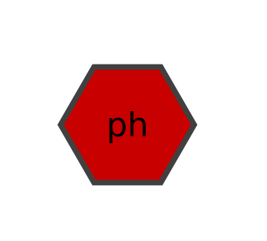
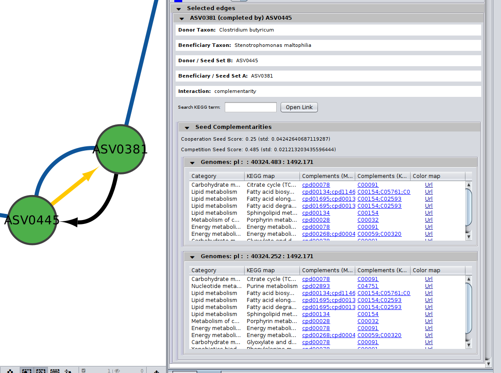

# Exploring annotated networks


## Exploring annotated nodes and edges


```{note}
**INPUT FILES USED IN THIS TUTORIAL**

We will use the _microbetag_-annogated network of the [network-based example-case](../tutorials_otf/from_net.md); 
you can get directly its corresponding `microbetag` - annotated network from [here][1].
```

<!-- [loaded](../basic_usage/load) -->
Once an annotated network is returned (or [loaded](../tutorials_core/load.md)) on your Cytoscape main panel, 
you have all Cytoscape features (e.g., annotation, filtering, selecting etc.) plus those coming from the _MGG_ App 
facilitating a user-friendly way to go through the annotations returned.

```{important}
Remember that to access the _MGG_ panels, you need to click 
`Apps > MGG > Show Results panel > Show results panel`
```
<!-- (see also [Loading models](../basic_usage/load#load-already-microbetag-annotated-networks) tutorial). -->


Remember that you can always use the Cytoscape core features on a _microbetag_-annotated network.
That means for example, in case you would prefer a different style than the one provided, 
you can always change node and edges colors and shapes etc. 
You can do this always for groups of nodes/edges. 
Anything you could do with a network on Cytoscape is still an option for a _microbetag_-annotated network.


## Visual style


### Nodes

The color-coding of the nodes (taxa) indicate the taxonomic level to which each sequence was assigned by _microbetag_.

- 🟩 node was mapped to a genome (i.e. species/strain) and annotations are available for it
- </a> 
  node was mapped to the genus level; annotations limited to literature-oriented (FAPROTAX) 
- 🟪 node was mapped to the family level; likewise, only FAPROTAX annotations occasionaly
- 🟥 node was mapped to higher taxonomic level and no annotations were returned
 


_MGG_ uses the `microbetag::ncbi-tax-level` column of the _microbetag_-annotated network returned to apply its visual style
one the network's edges. 
This column indicates the lowest taxonomic level (e.g., species, genus, family, etc.) at which the taxonomy of the sequence 
could be matched to the reference taxonomy scheme. 
The assigned NCBI Taxonomy ID corresponds to this matched level.

```{important}
We introduce the term "mspecies" to refer to the taxonomic level at which a node is directly mapped to a genome.
```

In case you have metadata variables in you analysis, those would be shown as **hexagons** having a 
`microbetag::ncbi-tax-level` column on the _Nodes_ table as `[metavar]`.




### Edges

Color-coding of the edges (taxa relationships) indicate the edge type, where **undirected** edges represent the co-occurrence score 
of the network and its color whether the two taxa cooccur or exclude one another, 
while **directed** edges represent potential metabolic complementarities.


- 🟦 undirected co-occurrence edge with positive score $\ge 0.1$
- 🟥 undirected co-occurrence edge with negative score $\ge 0.1$
- ⬛ undirected co-occurrence edge with $0.1\ge$ score $\ge 0.1$
- → directed complementarity edge; source being the potential donor and target the beneficiary
- 🟨 selected edge 


If you edit the style of your _microbetag_-annotated network, you can always bring back its original style through the MGG main menu.


## Investigating nodes' annotations

Once your _microbetag_-annotated model is imported and the _MGG_ results panel opened, 
you can now browse the network along with its annotations using both Cytoscape core features and those of _MGG_. 


Notice that the MGG results panel on its bottom has two options: 
the **Nodes** and the **Edges** panels. 
By default, the **Nodes** panel is selected. 
Let's start with that then!


By clicking on the *Show Species* button, all nodes that were not mapped to a genome will be masked, 
i.e. only nodes with a `microbetag::ncbi-tax-level` equal to `mspecies` will be shown. 


You can choose/click directly any node on the network and check the `Nodes` Panel 


or several at the same time


For more about how the `phenotrex`-oriented traits are assigned in each node you may have a look 
[here](../modules/modules.md#based-on-phendb) and for a thorough list of all the traits supported, 
you may check the corresponding [table](../modules/phen-traits).

In addition, for the FAPROTAX-based annotations, you may have a look [here](../modules/modules.md#based-on-faprotax) for how it works, 
and you can go through the whole list of potential traits supported in this [table](../modules/faprotax-functions).


### Filter for traits

You may select among a list of annotations under the `PhenDb/FAPROTAX filters` with `AND` and `OR` relationships.
For example, I was curious about the Nitrite-oxidizing bacteria (NOB) on my network


Likewise, you may go through the annotations on the edges of the network.

<!-- <p style="color: rgb(135,206,235)">Welcome to freeCodeCamp!</p> -->
<!-- Edges are either
 - <p style="color : Green">green</p> mentioning co-occurrences
 - <p style="color : Red">red</p> suggesting mutual exclusion of the two taxa
 - <p style="color : Black">black</p> representing ***directed*** potential metabolic interactions. 
 -->


## Investigating edges' annotations

Now, you can click on the **Edges** button on the bottom of the MGG panel to *jump* to the Edges annotations.

### Potential seed complementarities

Like in the case of the pathway complementarities, a new panel is displayed when seed complements are available for an edge.
Here is an example:


[*Seed scores*](../modules/modules.md#seed-scores-and-complements-based-on-genome-scale-draft-reconstructions-gems) 
between the two genomes are also shown here. 
Remember that like the edge under study, seed scores have also *directionality*; 

```{important}
Seed score for competition between $genome_A$ and $genome_B$ is not necessarily the same with the one between $genome_B$ and $genome_A$.
Those scores are only indicative, and they should not be considered as fact of observed cooperation/competition. 
```

In cases where more than one GTDB genomes were mapped to a node, then `microbetag` ends up with several seed scores on an edge. 
Thus, on the Edge panel we display their average and their corresponding standard deviation:




**Seed complements** are then shown on a collapsible table, where each row corresponds to the seeds related to a KEGG PATHWAY map. 
More specifically, each seed complement entry consists of: 

* The metabolism _Category_ the pathway is part of 
* A KEGG PATHWAY and its corresponding map
* The seed compounds related to KEGG modules involved in the PATHWAY in the ModelSEED namespace
* Their corresponding terms in the KEGG COMPOUNDS namespace 
* A colored URL highlighting the (PATHWAY-related) compounds that the beneficiary species can produce on its own (blue) and the
  complements that could potentially get from the donor


Each KEGG PATHWAY map belongs to a metabolism category in KEGG's hierarchy, with apparently, several maps to belong to the same category.

_microbetag_ returns all seed compounds related to such a map that the beneficiary could potentially get from the donor. 

For the on-the-fly version, since metabolic networks used in _microbetag_ have been reconstructed with ModelSEEDpy, it's the ModelSEED namespace in which 
the seeds complements are predicted, which are then mapped to their corresponding KEGG COMPOUND IDs.

```{note}
In case you are using _microbetag_ locally, and you reconstruct networks using _carveme_ or provide models in the BiGG namespace, 
current version of _microbetag_ will still first map them to the ModelSEED namespace.
```

```{important}
The returned complements in the seed complementarity module of `microbetag` are KEGG COMPOUNDs, 
each of which may participate in multiple metabolic pathways and thus, appear in more than one KEGG MAP. 
As a result, a single seed complement may be listed in multiple rows within the collapsible table — one for each KEGG map it is involved in.

```


### Potential pathway complementarities

By clicking on a potential metabolic interaction edge, the donor and the beneficiary species, along with their corresponding sequence identifiers will be displayed.

Then, for cases where pathway complementarities have been returned for this association, a panel will be available for each pair of genomes that were mapped to those two taxa. 
For each pair of genomes, a list with the potential metabolic complementarities is then returned. 
In the first column the KEGG MODULE ID of the corresponding complementarity is provided, and in the second and third column their description and metabolism category. 
In the fourth column, called *"Complement"* the KO that need to be provided to the beneficiary species to support the module are given and in the next column, the complete alternative that would then facilitate the module is shown; i.e., assuming the complement is provided.


In the final column a link to a related KEGG map is provided where KO available in the beneficiary species are colored with pink and those provided by the donor in the scenario of the potential metabolic interaction with green.
The screenshot below illustrates the highlighted complementarity in the biosynthesis of methionine.


## Save your work 


The best approach is to save your entire session, as you will likely apply various filters, annotations, and other modifications to your `microbetag`-annotated network. Simply click on `File > Save Session As...`, assign a name to your session, and Cytoscape will generate a `.cys` file. This allows you to reload the session later and resume exactly where you left off.

You can also export your network by using the rest of Cytoscape options.


[1]:../_static/download/mgg/hessler_microbetag_network.cx
