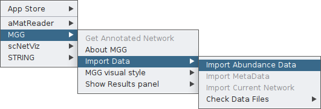
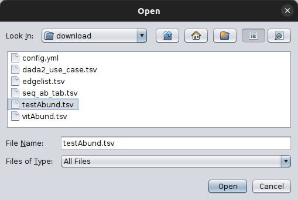
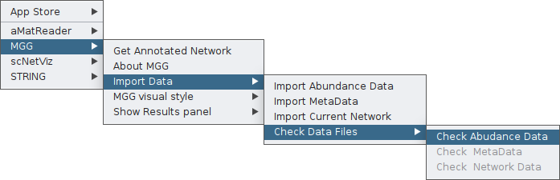
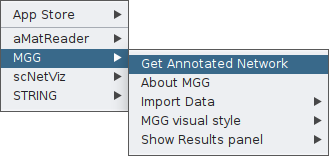
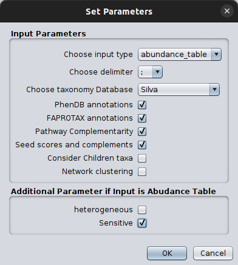
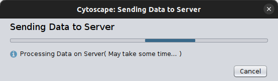
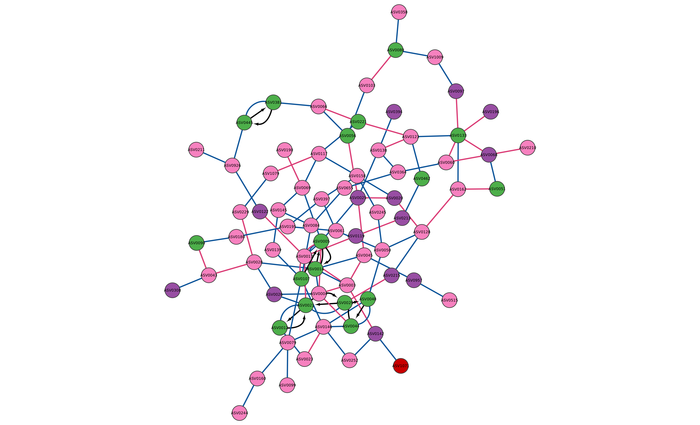

# .. using an abundance table

```{note}
**INPUT FILES USED IN THIS TUTORIAL**

In this example, we will use the [`testAbund.tsv`][3] file to showcase how to use microbetag without a network being already available.
```


In this case a co-occurrence network is **not** available so, *microbetag* will come up with one using 
<a href="https://doi.org/10.1016/j.cels.2019.08.002" target="_blank">FlashWeave</a>.
In case you already have a network, and you would like `microbetag` to use it, please check on the [Using a network](./from_net.md) tutorial.

```{danger}
**UPPER LIMIT FOR ABUNDANCE TABLE RECORDS**
 
When using the online *microbetag* version, it will build a co-occurrence network only for abundance tables with less than 1000 of records.
In case your abundance table is larger, you will have to run the [`microbetag` preprocess](./prep.md) step locally.
Otherwise, you can always run any algorithm for network inference locally and use their findings with microbetag.
```

<!-- The on-the fly creation of the co-occurrence network is supported only for abundance tables with **up to 1000 records**.
If your data include more sequencing records, then you will have to use the [`microbetag` preprocess](./tutorials/prep.md) step. -->

Once clicking on *Import Data* you currently see only the *Import Abundance Data* option.




By clicking on it, a pop-up box will ask you to provide your abundance table.
Select it with you mouse and then open it. 



You can view the imported data by clicking on the *Check Data Files* feature, for the case of the abundance table:



Once clicking that, a table will pop up where you can go through the data you have imported as the abundance table. 
Keep in mind that in case you have more than a few samples, or your abundaces have a long number of digirs, you will need to double-click to a column at a time to be able to see its values. 


You can now ask for a *microbetag-*annotated network by clicking on the corresponding feature:



Once clicking on that, a parameter-setting box will pop up, asking for values on a number of parameters **essential** for the successful network inference and their corresponding annotation.



For a thorough description of these parameters, 
please check the table on the [Input files and mandatory parameters](../tutorials_core/input.md) tutorial, 
as well as the relative [FAQs](../faq.md#setting-the-parameters-right).

Please make sure you set the input type as `abundance_table` and you select the correct [taxonomy scheme](../tutorials_core/input.md#basic-parameters).
It is crucial to also set the [FlashWeave related parameters](../faq.md#when-to-enable-the-sensitive-and-heterogeneous-arguments) in a way they address your abundance table idiosyncrasy.
<!-- In this case, we need `microbetag` to come up with a network as we only provide an abundance table; thus, we set the `Choose input type` to `abundance_table`.  -->
In our tutorial example, since the taxonomy scheme was Silva we choose this to map our taxa against.

The `get_children` can be useful in cases of non-trivial taxonomies for which there is no genomic information on microbetagDB for the species level, but there is such at lower levels (strains). 

Last but not least, we set the `Sensitive` parameter as `True` since we have a relatively low number of sequences;
this way FlashWeave may detect more subtle associations because it considers the full range of abundance variations.
However, this also makes the computation more intensive and slower, especially with large datasets.
See [FAQ](../faq.md) for more. 


```{important}
We suggest you do the network inference step as well as the mapping to the GTDB taxonomy before using _microbetag_ 
through the Cytoscape App, as this would provide you extra freedom on they network inference 
and gain dramatically in computing time on the server.
To this end, you may foloow the instructions on the [pre-processing tutorial](prep.md).
```

Once you set the parameters of your choice, you are ready to sent your query to the server by clicking *ok*.




After a few minutes (based on your data and the steps you have asked for) a _microbetag -_ annotated network will pop up automatically on your Cytoscape instance.




To explore the annotated network continue with [*Investigating the annotations* tutorial](./roaming.md).


```{hint}
**NEED HELP?**

There are several reasons you may either get a network with only a few nodes/edges annotated or get an error message from the server. 
Both scenarios are related to either the format of your input data or the parameters you have selected. 
Please, follow the guidelines you can find in the [*Input files*](../tutorials_core/input.md) tab 
and check our [*FAQ*](../faq.md) for common errors. 
If you still need some help, please go ahead and ask the _microbetag_ community on our 
<a href="https://matrix.to/#/#microbetagcommunity:matrix.org" target="_blank">Matrix community</a>.
```


[3]:../_static/download/mgg/testAbund.tsv

