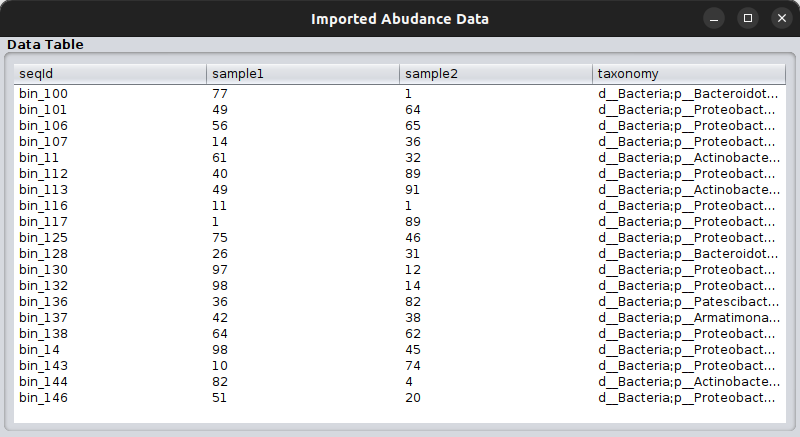
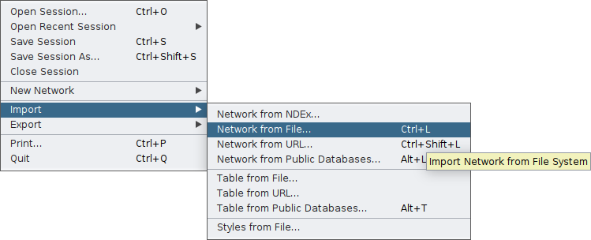
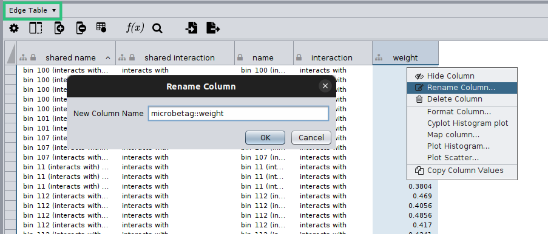
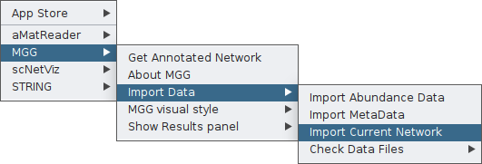
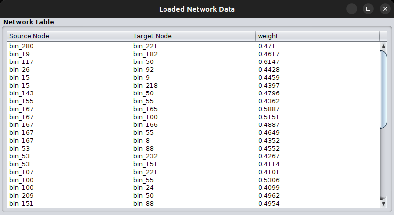
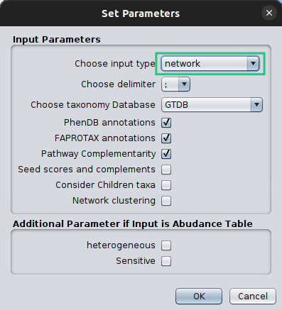
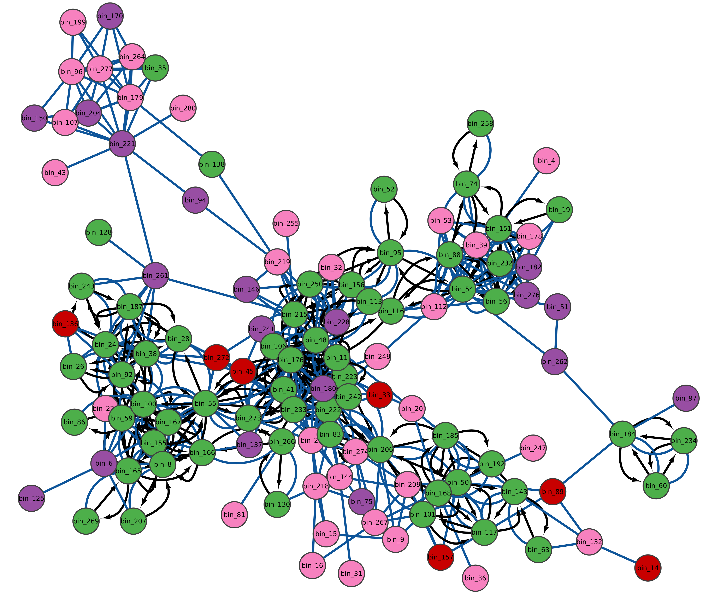

# .. using a co-occurrence network


In case you already have a co-occurrence network based on your data, you can ask `microbetag` to directly annotate it.
In this tutorial, we show how to run `microbetag` using a network of your own.

```{note}
**INPUT FILES USED IN THIS TUTORIAL**

The network we will use ([`edgelist.tsv`][2]) comes from the study of 
[Hessler et *al.* (2023)](https://doi.org/10.1038/s41467-023-40360-4) {cite:p}`hessler2023vitamin`.
We would like to thank the authors for sharing their data.
The abundance table ([`vitAbund.tsv`][1]) however does not represent the one of the actual study.
It is a pseudo abundance table that only includes the **bin names, exactly as they are called in the network file**, to *highlight* that **it is not the abundance data** that are of interest now.
Hessler et *al.* investigated factors that control community organization in mine tailings-derived laboratory microbial consortia and were able to link a *Variovorax* species as an important source of thiamine.
```

If you already have a network, then you need to provide **both the network and the abundance table** and **make sure that the sequence identifiers in those two files are the same**; 
meaning that the *node ids of the network are present in the abundance table in the column representing the sequence identifier*.

For example, a toy model of a network file would be: 

| node_A  | node_B | weight  | 
|:-------:|:------:|:-------:|
| bin_1   | bin_2  |  0.84   |

then, the corresponding abundance table would have, among other records, to have the following two lines:

| sequenceIdentifier | sample_1 | sample_2| sample_3| taxonomy | 
|:------------------:|:--------:|:-------:|:-------:|:-------:|
|bin_1|  234 | 42 | 43| g__Devosia;s__Devosia sp001899045
|bin_2 | 324| 54 | 43 | g__Pseudonocardia;s__Pseudonocardia sp001899645


```{note}
Taxonomy here is only partial. 
Make sure you always have a 7-level taxonomy, e.g. 
`d__Bacteria;p__Proteobacteria;c__Alphaproteobacteria;o__Rhizobiales;f__Devosiaceae;g__Devosia_A;s__Devosia_A sp001899075`
```

So, this time we will load the [`vitAbund.tsv`][1] file. 
Here how this looks like:




Then, you need to import your network **first** *on Cytoscape* through the main `File` tab:




Cytoscape will display your network and on the bottom of your screen you will have the core tables of a Cytoscape network. 
As your network may have several edges, you need to make clear which edge attribute you would like `microbetag` to use; this is essential in cases network clustering will be performed. 
To do so, you need to move on the *Edge table* by clicking on the arrow next to the *Node table* that is displayed by default, and then **rename** the column of your choice to `microbetag::weight`. 




Now you are ready to import your network *to MGG* though its main menu on the `Apps` tab:



Finally, you can again check your network as loaded on MGG through the `Check Data Files` tab:




```{important}
If the node names of the network are not included in the sequence identifiers of the abundance table, you will not be able to import your network to MGG.
```

Once both your abundance file and your network are imported, you can proceed as in the [*Starting from an abundance table*](./abd_only.md) case by clicking on `Get Annotated Network` on the main menu of the `MGG` app on the `Apps` tab and setting the parameters required.



Make sure that you set the `Choose Input Type` as `network` this time, otherwise `microbetag` will ignore your network and try to build on of their own. 


This will take significantly less time and here is the returned network: 





Now, you can go through the [*Investigating the annotations*](./roaming.md) tutorial to check how good `microbetag` did with *Variovorax* - related annotations.


[1]:../_static/download/mgg/vitAbund.tsv
[2]:../_static/download/mgg/edgelist.tsv

