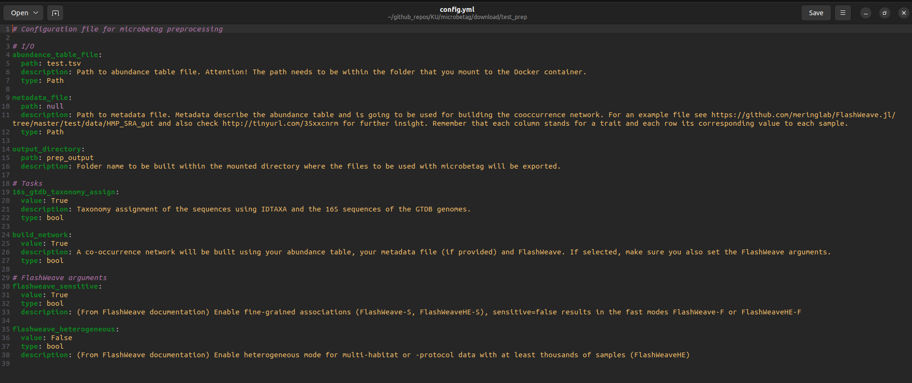

# `microbetag` preparation steps


<span class="label-green">microbetag web-app v1.0.1</span>

<div style="display: flex; gap: 10px;">
   <a href="https://hub.docker.com/layers/hariszaf/microbetag_prep/v1.0.1/images/sha256-084c547fe88f5bd09bb44cbb960dcacdcb0ded78d55214c80da123bcfb9b864f?context=repo" class="btn-green"> Docker image </a>
   <a href="https://github.com/hariszaf/microbetag/tree/preprocess/test" class="btn-purple"> Tutorial files </a>
</div>


```{important}
**INPUT FILES USED IN THIS TUTORIAL**

For the `microbetag` preparation tutorial, i.e., the steps you may run to come up with a co-occurrence network and taxonomically assign your sequences using the GTDB resource, we will use the following 2 files: 

 - the [`seq_ab_tab.tsv`][1] as our abundance table, which in its last column instead of a taxonomy includes the **ASV sequence**
 - the [`config.yml`][2] where you may set your arguments for how to run the `microbetag_prep` image
```

## The *preparation* step

`microbetag` is a one-stop-shop application as it supports the taxonomic annotation of ASVs/OTUs, the building of the co-occurrence network and its annotation. 
However, its main goal is the latter and at the same point, the first two tasks can be computationally expensive especially for large datasets.
To this end, a Docker/Singularity image is available supporting the taxonomy assignment of the ASVs/OTUs with GTDB taxonomies 
<a href="https://zenodo.org/records/6655692" target="_blank">a taxonomy annotated abundance file with the 16S GTDB (v.207) taxonomies</a> 
and the creation of the co-occurrence network if asked. 


<a href="https://docs.docker.com/get-docker/" target="_blank">Docker</a> or 
<a href="https://docs.sylabs.io/guides/3.0/user-guide/installation.html" target="_blank">Singularity</a>
needs to be installed. 
Then, download the `microbetag_prep` image either by running: 


```bash
docker pull hariszaf/microbetag_prep:<version>
```


or 
```bash
singularity pull docker://hariszaf/microbetag_prep:<version>
```

```{note}
Leaving `<version>` blank will pull the latest version of the image
```


Then you need to also download the<a href="https://raw.githubusercontent.com/msysbio/microbetag/preprocess/test/config.yml" download="config.yml">`config` file</a> and edit it accordingly. 


```{attention}
The `cofing.yml` file and the input files to be used, need to be in the directory 
to be mounted (see Docker and Singularity commands below).
```

```{attention}
Do not mistake the configuration file used by the preprocessing tool for the one required by _microbetag_.
```


## I/O folder 

The folder to be mounted needs two mandatory files:
- an abundance table 
- the `config.yml` file


Two main steps are to be performed from this preparation image. 
A taxonomy annotation of the OTUs/ASVs to GTDB taxonomies using the IDTAXA algorithm of the DECIPHER package and the 16S sequences of the GTDB genomes or/and the building of a co-occurrence network using FlashWeave. 

The user can select which tasks to run through the `16s_gtdb_taxonomy_assign` and the `build_network` arguments. 

A thorough description of each argument can be found below as well as in the `config.yml` template.


|**Parameter**                |**Description**                                                                                         |
|-----------------------------|--------------------------------------------------------------------------------------------------------|
|``abundance_table_file``     | An OTU/ASV abundance table with a sequence identifier in first column and the sequence in the last one |
|``metadata_file``            | A metadata file with samples as rows and descriptions characterizing the samples as columns For an example file see https://github.com/meringlab/FlashWeave.jl/tree/master/test/data/HMP_SRA_gut. |
|``build_network``            | Build co-occurrence network using FlashWeave |
|``16s_gtdb_taxonomy_assign`` | Taxonomy assignment of the sequences using IDTAXA and the 16S sequences of the GTDB genomes. |
|``flashweave_sensitive``     | (From FlashWeave documentation) Enable fine-grained associations (FlashWeave-S, FlashWeaveHE-S), sensitive=false results in the fast modes FlashWeave-F or FlashWeaveHE-F  |
|``flashweave_heterogeneous`` | (From FlashWeave documentation) Enable heterogeneous mode for multi-habitat or -protocol data with at least thousands of samples (FlashWeaveHE) |
|``output_directory``         | Output folder name; it will be created within the mounted folder |


### Docker

To run directly 

```bash
docker run --rm -v ./test/:/media hariszaf/microbetag_prep:v1.0.0
```

In this case it is the `./test/` local directory you mount in the `/media` folder on the container.


If you would like to initiate an interactive container you may run: 

```bash
docker run --rm -it --entrypoint /bin/bash -v ./test/:/media microbetag_prep:v1.0.0
```
this would initiate a console from within the container with you as a root user:

```bash
root@69bdeedb582b:/pre_microbetag#
```


```{highlight}
This case can be useful when several FlashWeave arguments not included in the basic config file need to be edited. 
```

You can see what is present under the `/pre_microbetag` directory:
```bash
root@69bdeedb582b:/pre_microbetag# ls
classify.R  flashweave.jl  gtdb_16s.RData  prep.py
```

and edit scripts, e.g.:

```bash
vim flashweave.jl
```

### Singularity

The equivalent commands in Singularity would be :


To run the pre-process directly:
<!-- --env USER_ID=$HOST_USER_ID --env HOST_GID=$HOST_GROUP_ID -->


```bash
singularity run -B ~/prep_test/:/media microbetag_prep_latest.sif 
```

where again, you mount (`-B`) the `~/prep_test/` local directory to the `/media` folder on the container.

Likewise, to open a console:

```bash
singularity exec -B ~/prep_test/:/media microbetag_prep_latest.sif bash
cd /pre_microbetag/
``` 


## An example case

We will use the findings of a 16S rRNA analysis with <a href="https://benjjneb.github.io/dada2/" target="_blank">DADA2</a> 
that we have exported in a `.tsv` file. 
We show how to get a *microbetag*-annotated co-occurrence network with this matrix as your only input.
More complex scenarios can be the case, however they are all based on the principles described here.


```{tip}
Having an already optimal co-occurrence network to annotate is essential from a biological point-of-view.
Thus, we strongly suggest you first build your co-occurrence network using FlashWeave or any inference tool 
on your own, in order to address the idiosyncrasy of your data the best you can. 

In the framework of microbetag, you can do that by running the pre-processing Docker image we provide. 
You may check the [FAQs](../faq.md#when-to-enable-the-sensitive-and-heterogeneous-arguments) 
for FlashWeave's most essential parameters you can set through the `config.yml` file of the preprocessing image.
In addition, you can edit the `flashweave.jl` script to adjust it to your needs; you may check for more information the 
<a href="https://github.com/meringlab/flashweave.jl" target="_blank">FlashWeave documentation</a> 
direclty.
```


[Download][1] the data set if you have not done so already.
After a quick look at it, you will notice that it consists of 1,004 ASVs; just 4 more than `microbetag`'s up limit to build a network on the fly.
However, most often than not, this number can range up to several hundreds of ASVs or OTUs for amplicon analyses.
In both cases, the preprocessing step is required.
Moreover, you will notice that in this abundance table, in the last column there is not a taxonomy but the corresponding ASV instead.
That is because we want to use the GTDB taxonomy based on the 16S rRNA gene, so we map our ASVs to their closest GTDB genomes. 

<!-- For the preparation, we will use the [`microbetag_prep` Docker image](https://hub.docker.com/r/hariszaf/microbetag_prep).  -->
<!-- If you do not have the `microbetag_prep` image on your computer system yet, please follow the instructions you may find in the [Preparation](../input.md#the-preparation) paragraph.  -->
<!-- If [Docker](https://www.docker.com) is not available either, you will have to [install it](https://docs.docker.com/get-docker/).  -->

Assuming both Docker and the `microbetag_prep` image are installed, you should be able to run and among your images find the one for the preparation steps:

```bash
(base) u0156635@gbw-l-l0074:git$ docker images
REPOSITORY                 TAG       IMAGE ID       CREATED         SIZE
hariszaf/microbetag_prep   latest    1500f6f7a0aa   7 weeks ago     3.92GB
```

Open a terminal and create a new folder (e.g. `my_microbetag_prep`)

```bash
mkdir my_microbetag_prep
```

Move (or copy) your abundance table in the directory you just created. 
Assuming you downloaded the data from the link above in your `Downloads`: 

```bash
mv ~/Downloads/seq_ab_tab.tsv my_microbetag_prep/
```

Now, you need to get the `config.yml` file and move it or keep a copy of it in the `my_microbetag_prep` folder. 
<!-- 
If you have already downloaded this then you need to move/copy it in the `my_microbetag_prep` folder too. 
If you have not, then you may run 
```bash
cd my_microbetag_prep  # to move into your folder
wget https://raw.githubusercontent.com/hariszaf/microbetag/preprocess/test/config.yml
``` 
-->

Your `my_microbetag_prep` folder should now look like:

```bash
(base) u0156635@gbw-l-l0074:my_microbetag_prep$ ls
config.yml  seq_ab_tab.tsv
```

Before firing the preparation, you need to set the values of the parameters described in the `config.yml` file.
If you feel confident with the terminal, you can do so by `nano`, `vim` or any other editor you are using.
Otherwise, you can always go to the `my_microbetag_prep` folder and double-click on the `config.yml` file.
In this case, you will see something like:




No matter how you edit the file, you need to make sure the following: 

- provide the filename of your abundance table in the `abundance_table_file` parameter; in our case that would be `seq_ab_tab.tsv`

```{important}
**SEQUENCE OR TAXONOMY?**

Please, make sure you have not comment lines on top of your file
Your abundance table needs to start with a header, in the first column having the sequence identifier and in the **last one** either the **taxonomy** if only the network inference is to be performed or the **sequence** itself in case you need to perform the GTDB assignment as well.
Also, avoid numbers as sequence identifiers (e.g., 5434), instead use alpharithmetics (e.g., ASV_5434).
```

- the tasks you want to perform by setting them to `True` or `False`; in our case, we will both use the 16S-oriented GTDB taxonomy and build a network. Thus we set both `16s_gtdb_taxonomy_assign` and `build_network` as `True`.


In case you have asked for building a network, then you also need to consider setting the two related parameters.
You may check this [FAQ](../faq.md#when-to-enable-the-sensitive-and-heterogeneous-arguments) and of course advise the FlashWeave GitHub and paper for that. 
In our case, we set `flashweave_sensitive` as `True` and `flashweave_heterogeneous` as `False`.


- if available, provide the filename of your metadata file; for instructions on how this file should be formatted, 
  please see [here](../tutorials_core/input.md#abundance-table) as well as the <a href="https://github.com/meringlab/FlashWeave.jl" target="_blank">FlashWeave documentation</a>


Now, based on your container technology you are ready to run the preparation image.

An example of a directory to mount can be seen <a href="https://github.com/msysbio/microbetag/tree/preprocess/test" target="_blank">here</a>.
The mandatory abundance table file can be provided as a `.tsv` or a `.csv` file and needs to be specified in the `config.yml` file accordingly.


Now, we are ready to fire the pre-process by running the following command:

```bash
docker run --rm -v ./my_microbetag_prep/:/media hariszaf/microbetag_prep
```

Make sure you are in the parent folder of the `my_microbetag_prep` directory. 

If you would like to edit the FlashWeave script and add extra argument on it, you can 
fire a Docker container as explained [above](#docker) and edit the script as you wish.


Once the preprocessing is completed (based on your input this could take up to hours)
you will find two output files, 

- `GTDB_tax_assigned_abundance_table.tsv`: this is your abundance table but instead of the corresponding sequence to each ASV/OTU, now you have their corresponding GTDB-based taxonomy
- `network_output.edgelist`: This is the network built from FlashWeave. You may skip its first two lines and check the 3-column format after that, where the first two columns give a pairwise association of two ASVs/OTUs and the third one its value that can be either positive or negative, denoting co-occurrence or depletion correspondingly.


```{important}
**REMOVE TAXA NOT PRESENT IN THE NETWORK**
 
Once you have come up with your network, you can remove the non-present taxa from your abundance table. This will save you quite some time! 
```


[1]:../_static/download/prep/seq_ab_tab.tsv
[2]:../_static/download/prep/config.yml

