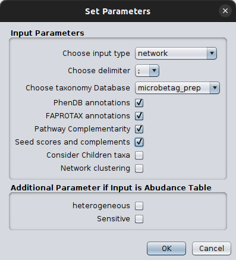

## Using microbetag: a pseudo real-world scenario

In this tutorial, we have used the findings of a 16S rRNA analysis with [DADA2](https://benjjneb.github.io/dada2/) that we have expoted in a `.tsv` file. 


{: .important-title}
> BEST PRACTICE
>
> Having an already optimal co-occurrence network to annotate is essential from a biological point-of-view.
> Thus, we strongly suggest you first build your co-occurrence network using FlashWeave or any inference tool 
> on your own, in order to address the idiosyncracy of your data the best you can. 
> In the framework of microbetag, you can do that by running the pre-processing Docker image we provide and by editing the
> `flashweave.jl` script (see the [preparation step](input.md#the-preparation) as well as the [FlashWeave documentation](https://githubhelp.com/meringlab/FlashWeave.jl) for more).


After [downloading][1] the data set and a quick look at it, you will notice that it consists of 1,004 ASVs; just few more than the capacity that `microbetag` can handle on the fly.
However, most often than not, this number can be up to several hundreds of ASVs or OTUs for amplicon analyses.
Thus, the preprocessing step is required.
Moreover, you will notice that in this abundance table, in the last column there is not a taxonomy but the corresponding ASV. 
That is because we want to use the GTDB taxonomy based on the 16S rRNA gene so we map our ASVs to their closest GTDB genomes. 

For the preparation, we will use the [`microbetag_prep` Docker image](https://hub.docker.com/r/hariszaf/microbetag_prep). 
If you do not have the `microbetag_prep` image on your computer system yet, plase followi the instructions you may find in the [Preparation](./input.md#the-preparation) paragraph. 
If [Docker](https://www.docker.com) is not available either, you will have to install it as described [here](https://docs.docker.com/get-docker/). 

Once both Docker and the `microbetag_prep` image are installed, you should be able to run

```bash
(base) u0156635@gbw-l-l0074:git$ docker images
REPOSITORY                 TAG       IMAGE ID       CREATED         SIZE
hariszaf/microbetag_prep   latest    1500f6f7a0aa   7 weeks ago     3.92GB
```

Now we need need to follow the instructions of the Preparation section and build our [I/O folder](./input.md#io-folder).

Open a terminal and create a new folder (e.g. `my_microbetag_prep`)

```
mkdir my_microbetag_prep
```

Move (or copy) your abundance table in the directory you just created. 
Assuming you downloaded the data from the link above in your `Downloads`: 

```bash
mv ~/Downloads/seq_ab_tab.tsv my_microbetag_prep/
```

Now, you need to get the `config.yml` file. 
If you have already download this then you need to move/copy it in the `my_microbetag_prep` folder too. 
If you have not, then you may run 

```bash
cd my_microbetag_prep  # to move into your folder
wget https://raw.githubusercontent.com/hariszaf/microbetag/preprocess/test/config.yml
```

By running the `ls` command you will have to see two files 

```bash
(base) u0156635@gbw-l-l0074:my_microbetag_prep$ ls
config.yml  seq_ab_tab.tsv
```

That is all you need! However, before firing the preparation, you need set the values of the parameters described in the `config.yml` file. 
If you feel confident with the terminal, you can do so by `nano`, `vim` or any other editor you are using. 
Otherwise, you can always go to the `my_microbetag_prep` folder and double-click on the `config.yml` file. 
In this case, you will see something like:


No matter how you edit the file, you need to make sure the following: 

- provide the filename of your abundance table in the `abundance_table_file` parameter; in our case that would be `seq_ab_tab.tsv`

{:. important-note}
> Please, make sure you have not comment lines on top of your file
> Your abundance table needs to start with a header, in the first column having the sequence identifier and in the **last one** either the **taxonomy** if only the network inference is to be performed or the **sequence** itself in case you need to perform the GTDB assignment as well.
> Also, avoid numbers as sequence identifiers (e.g., 5434), instead use alpharithmetics (e.g., ASV_5434).

- the tasks you want to perform by setting them to `True` or `False`; in our case, we will both use the 16S-oriented GTDB taxonomy and build a network. Thus we set both `16s_gtdb_taxonomy_assign` and `build_network` as `True`.


In case you have asked for building a network, then you also need to consider setting the two related parameters.
You may check this [FAQ](./faq.md#what-is-sensitive-and-heterogeneous-in-flashweave) and of course advise the FlashWeave GitHub and paper for that. 
In our case, we set `flashweave_sensitive` as `True` and `flashweave_heterogeneous` as `False`.


- if available, provide the filename of your metadata file; for instrctuctions on how this file should be formatted, please see [here](https://hariszaf.github.io/microbetag/docs/input/#case-1-all-you-have-is-your-abundance-table-and-your-taxonomies) as well as the [FlashWeave documentation](https://github.com/meringlab/FlashWeave.jl)


Now, we are ready to fire the preprocess by running the following command:

```bash
docker run --rm -v ./my_microbetag_prep/:/media hariszaf/microbetag_prep
```

Make sure you are in the parent folder of the `my_microbetag_prep` directory. 

If you would like to edit the flashweave script and add extra argument on it, you can 
fire a Docker container as expained [here](./input.md#io-folder) and edit the script as you wish.


Once the preprocessing is completed (based on your input this could take up to hours)
you will find two output files, 

- `GTDB_tax_assigned_abundance_table.tsv`: this is your abundance table but instead of the corresponding sequence to each ASV/OTU, now you have their corresponding GTDB-based taxonomy
- `network_output.edgelist`: This is the network built from FlashWeave. You may skip its first two lines and check the 3-column format after that, where the first two columns give a pairwise association of two ASVs/OTUs and the third one its value that can be either positive or negative, denoting co-occurrence or depletion correspondingly.


Now, we can get those two files returned and jump into Cytoscape. 
Open Cytoscape and then click on `File > Import > Network from file` and browse on the pop up box to your `network_output.edgelist` file. 

You will then see another pop up box like this: 


Cytoscape needs always to have a *source* and a *target* node, even in cases of undirected graphs, such as the co-occurrence networks.
Therefore, click on the first two column headers and set one as the source and the other as the target by clicking on the corresponding symbols: 


finally, you need to always set the column that `microbetag` will consider as your weight column, in this case, we have only one column with a weight however in cases that a network is not built like that, may have several. 
Thus you need to click on the corresponding column header and set it as `microbetag::weight`.
Now `microbetag` is able to recognize which column to handle as the *weight* of your network.
By clicking `OK` your network will be shown on Cytoscape's main panel. 

Now you are ready to import your abundance table. 
Go to `Apps > MGG > Import Data > Import Abundance Data` and browse to the `GTDB_tax_assigned_abundance_table.tsv` file returned from the `microbetag_prep` running.
Load the network data to the app by clicking `Apps > MGG > Import Data > Import Current Network`.

{: .note}
> The order here is important! `microbetag` will not allow you to import first your network and then your abundance table. 

You can check on the imported date by clicking `Apps > MGG > Import Data > Check Data Files`.
Once you make sure you have loaded what you wanted, you are ready to ask `microbetag` to annotate your network! 
Just click `Apps > MGG > Get Annotated Network`.
Set the parameters as discussed in the [*Run `microbetag` from a co-occurrence network*](./cytoApp.md#starting-from-a-co-occurrence-network) section 




and click `OK`. 
Then a *Sending data to the server* loading bar will appear. 
After a few moments, a new network will pop up on your Cytoscape main panel! 

That's it! 
You may now *"roam"* across your annotated network as 
explained [here](./cytoApp.md#roaming-acrross-annotated-nodes-and-edges)

[1]:{{ site.url }}/microbetag/download/seq_ab_tab.tsv


<!-- 
Dataset:
 -->


