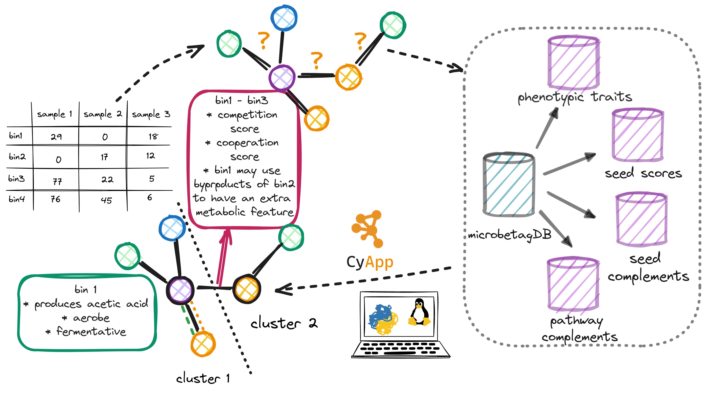
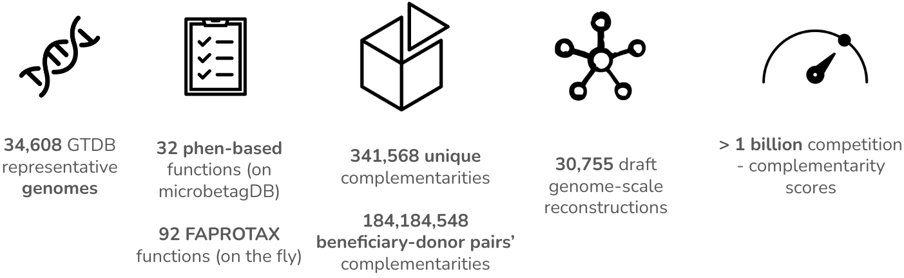

# About 

   <a href="https://apps.cytoscape.org/apps/mgg" class="btn-green" target="_blank"> CytoscapeApp </a>
   <a href="https://github.com/hariszaf/microbetag" class="btn-purple" target="_blank"> View it on GitHub </a>
   <a href="https://matrix.to/#/#microbetagcommunity:matrix.org" class="btn-blue" target="_blank"> Join us on Matrix </a>

Co-occurrence networks have been widely used for inferring microbial associations or/and interactions from metagenomic data.
However, spurious associations and tool - dependence confine the network inference.
The integration of previous evidence or/and knowledge can increase or decrease the confidence level of the retrieved associations.
This way, associations can be further investigated, and more reliable conclusions can be drawn.

***microbetag*** implements data integration techniques to annotate both the nodes (taxa) 
and the edges (predicted associations) of such a network, 
to enhance microbial co-occurrence network analysis for amplicon data.
Combined with network clustering and enrichment analysis, *microbetag* can benefit microbial co-occurrence network interpretation and provide hypothesis to be further tested.

A detailed description of [*microbetag*'s modules](./modules/modules.md) outlines the various information channels.
*microbetag* can be used through two [usage modes](./modes.md). 
We provide a series of tutorials to guide users through different scenarios and help achieve their specific goals.

### Contact

For hints on how to use microbetag, ideas for new features and bug reports find us on out <a href="https://matrix.to/#/#microbetagcommunity:matrix.org" target="_blank">Matrix space</a>.
If you do not have a Matrix account, it's only two clicks away! 
For more information, take some time to check <a href="https://matrix.org/docs/chat_basics/matrix-for-im/" target="_blank">its basics</a>.

### Cite us
Zafeiropoulos, H., Michail Delopoulos, E. I., Erega, A., Schneider, A., Geirnaert, A., Morris, J., & Faust, K. (2024). 
<a href="https://doi.org/10.1101/2024.10.01.616208" target="_blank">microbetag: simplifying microbial network interpretation through annotation, 
enrichment tests and metabolic complementarity analysis</a>. bioRxiv, 2024-10.

### Funding

This project was funded by an <a href="https://www.embo.org/funding/fellowships-grants-and-career-support/scientific-exchange-grants/" target="_blank">EMBO Scientific Exchange Grants</a> 
and the <a href="https://www.3domics.eu" target="_blank">3D’omics</a> Horizon 2020 project (101000309).

<!-- https://www.embo.org/documents/news/facts_figures/EMBO_facts_figures_2021.pdf -->

### License

- *microbetag* is under <a href="https://opensource.org/license/gpl-3-0" target="_blank">GNU General Public License v3.0</a>. 
   For third-party components separate licenses apply. 

- The `MGG` Cytoscape App is under <a href="https://opensource.org/license/apache-2-0" target="_blank">Apache License, Version 2.0</a>.

