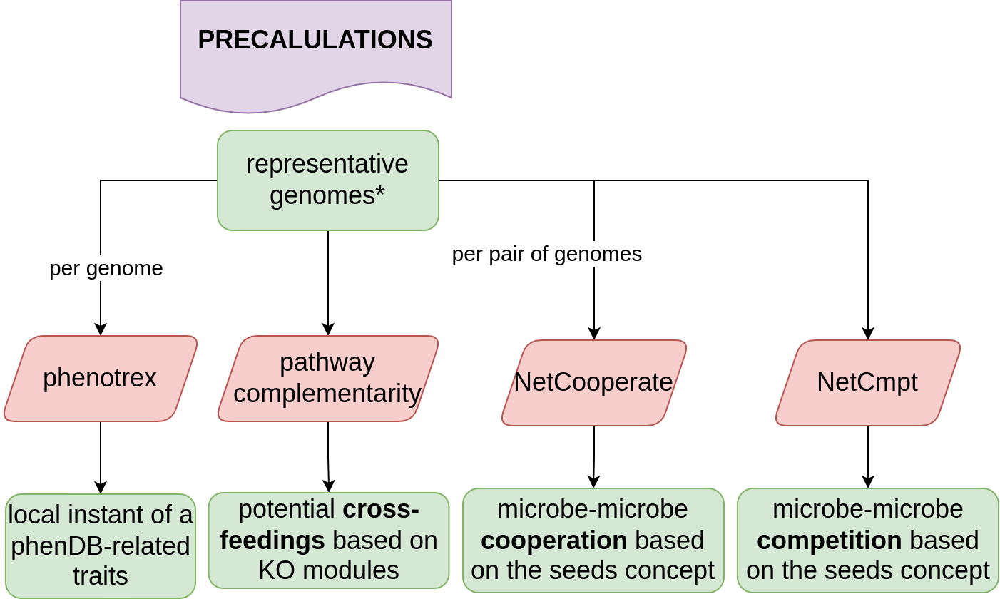

# Building the microbetag database

In this folder we have the source code for coming up with the precalculations of `microbetag`.




## PhenDB

To install `phenotrax`:

```
git clone https://github.com/univieCUBE/phenotrex.git
cd phenotrex
make full-install

mkdir classes
# deepNOG classes
wget http://fileshare.csb.univie.ac.at/phenotrex/latest/deepnog_classifier.tar.gz
tar -zxvf deepnog_classifier.tar.gz
rm deepnog_classifier.tar.gz
```

However, using the deepNOG classes lead to the following error during loading the classifier.:

```
ModuleNotFoundError: No module named 'phenotrex.ml.vectorizer'
```

We could use the inital classes though:

```
wget http://fileshare.csb.univie.ac.at/phenotrex/latest/classifier.tar.gz &&\
        tar -zxvf classifier.tar.gz &&\
        rm  classifier.tar.gz
```

To get the GTDB ref-genomes:

```
wget https://data.gtdb.ecogenomic.org/releases/latest/genomes_reps/gtdb_genomes_reps.tar.gz
```

To run phenotrex, you first annotate your genomes:

```
phenotrex compute-genotype GCA_000692775_1_trunc2.fna --out dna.genotype
```

and then you predict based on several classes:

```
phenotrex predict --genotype dna.genotype --classifier AOB.svm.class  > predictions.tsv
```

> One might get the genomes the models were trained with from the phenDB site, e.g: [https://phendb.org/reports/modeldetails?model_id=39](https://phendb.org/reports/modeldetails?model_id=39 "https://phendb.org/reports/modeldetails?model_id=39") go on the " Training Data" link

The info reg if a taxon is aerobe or an anaerobe, comes also from bugbase!

## Pathway complementarity

ad

## Seed parts

asdasd
